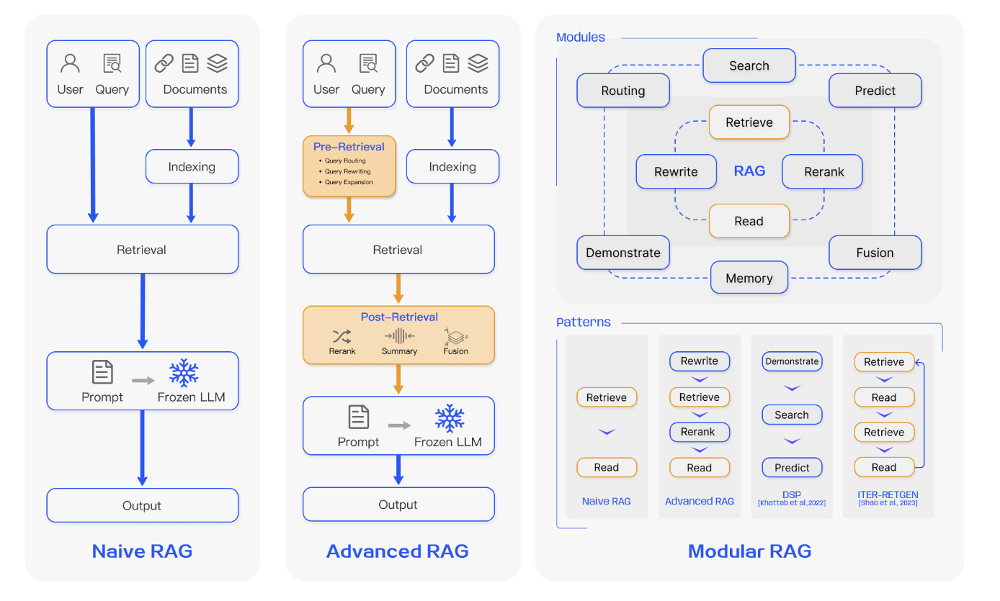
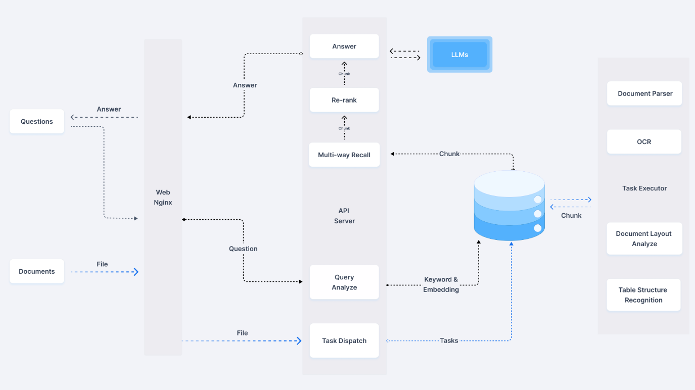
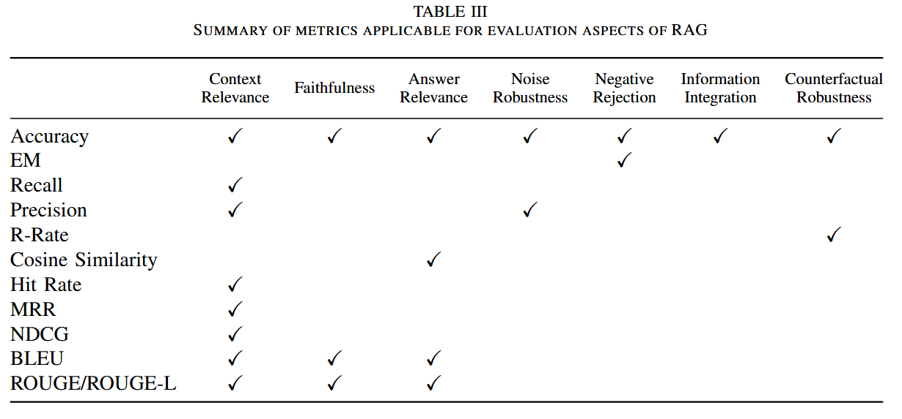
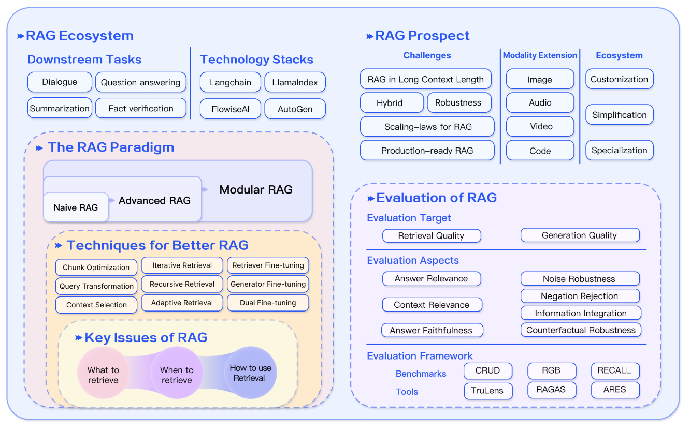

# 10 月实习记录

## 综述阅读：Retrieval-Augmented Generation for Large  Language Models

### 1. RAG 系统构成

检索增强生成（RAG）系统是一种结合了信息检索与生成模型的先进架构，旨在提升自然语言处理（NLP）的能力。系统的核心理念在于通过检索机制为大型语言模型（LLM）提供实时、相关的背景信息，从而使生成的回答更加准确和可信。

- 朴素 RAG（Naive RAG）作为 RAG 系统的基础实现，主要依赖于将检索到的文档片段直接输入到语言模型中进行回答生成。这种方法简单易用，适用于回答较为直接且上下文要求不高的问题。然而，在处理需要多层推理或复杂背景的任务时，朴素 RAG 的效果往往会受到限制。

- 进阶 RAG（Advanced RAG）引入了更复杂的检索策略。进阶 RAG 通过实现前检索（Pre-Retrieval）和后检索（Post-Retrieval）的方法，优化了信息获取的质量。例如，在检索之前，系统先分析用户的查询意图，然后基于意图选择最相关的文档块进行检索；而在获取检索结果后，系统对文档内容进行重排序，以确保最相关的信息优先呈现给模型，避免受“中间遗忘”影响。这种方式显著提高了 RAG 系统在复杂场景下的有效性，但依然依赖于单一检索结果。

- 模块化 RAG（Modular RAG）则是对 RAG 框架的进一步扩展和优化。它通过引入灵活的模块化设计，允许系统根据具体任务需求进行动态调整。在模块化 RAG 中，各个组件（如检索器、生成器、评估器）可以根据任务的不同要求进行组合或替换，这种灵活性使得系统能够应对多样化和动态变化的任务需求。例如，模块化 RAG 可以同时处理多轮对话和信息整合任务，这在朴素和进阶 RAG 中是难以实现的。因此，模块化 RAG 在实际应用中表现出色，尤其是在需要复杂推理和多层次理解的场景中，展现出更强的适应性和性能。

---

>  在构建RAG系统时，最基本的两个要素分别是 **Retrieval** 和 **Generation**， 其中 Retrieval 又可以分出 Indexing 这个小步骤。在之后构建的系统中，可以考虑从 Naive RAG 开始，先通过 langchain 这样的集成式工具包装提供的现有开源方案，构建一个 Indexing - Retrieval - Generation 的初步模型，再对方案从结构、组成部分，组分细节等方面进行逐步的改进。
>
> 最终完成的 Agent 成品应该属于 Advanced RAG 类型，作为资料检索助手侧重于根据查询提供准确，全面的信息，同时作为 code partner 提供代码编写辅助。

### 2. RAG 检索

#### 2.1. 检索原理

RAG 系统的检索机制是其核心功能之一，旨在为生成模型提供相关的上下文信息。其关键步骤包括**索引（indexing）、查询处理和文档检索**。

在索引阶段，系统首先对大量文本数据（如文档、知识库等）进行预处理，提取关键信息并构建索引。这一过程涉及文本的分词、去除停用词和生成嵌入向量等操作。通过这种方式，系统能够将文本数据转换为一种适合快速搜索的形式，通常是转化为存储在向量数据库（vector database）中的向量，从而在后续的检索中实现高效的相似性搜索。

当用户提出查询时，系统将该查询转化为向量表示，利用预先构建的索引进行检索。检索过程会计算查询向量与文档向量之间的**相似度**，以找出与查询最相关的文档片段。检索到的文档片段随后会与问题一同被输入到生成模型中，辅助模型生成更为准确和上下文相关的回答。

#### 2.2. 检索优化

##### 2.2.1. 索引优化

目前常见的 Indexing 操作是将长文本以分块（chunk）形式进行分割，将大型文档拆分成较小的（限定最大字符数的）段落或块，也有方案采用 Phrase 或 Sentence 作为分割单位（但这类方案较少）。

分块后的文本在进行 Embedding 之前可以通过添加元数据（matadata，如文档类别、关键词、创建日期等）组成集合的方式加以优化；通过基于这些元数据进行检索过滤，可以限制检索的范围，提升检索的精确性。此外，在检索过程中为文档时间戳分配不同权重，可以实现时间感知的 RAG，确保知识的时效性，避免过时信息的使用。除了从原始文档中提取元数据外，元数据还可以通过人工构造。例如，可以为段落添加摘要，并引入假设性问题，这种方法也被称为逆向 HyDE。具体来说，利用 LLM 生成可以被文档回答的问题，并在检索时计算原始问题与假设性问题之间的相似性；通过这种方式，可以缓解问题与答案之间的语义差距过大带来的检索不准确问题。

在 Indexing 之前，首先需要获取 **适合** 进行 indexing 的输入。这种输入包括完全纯文本输入（txt, etc.）和带有一定格式标记的文本输入（markdown, adoc, etc.）。对于 PDF、DOCX 等格式的文件，则需要先进行解析，转换为合适的文本序列，再进行 Indexing。图片形式的文本文档需要先进行 OCR。文档中带有的图片、表格等内容也属于难点；目前部分解决方案选择采用数据库存储表格，这或许是一个可行的思路。

动态更新索引也是索引优化策略的一部分。随着文档库的不断扩展和更新，能够及时反映新信息的索引是必要的。尤其在 RustSBI Agent 项目中，随着语言标准、IoT 设备标准等的不断更新和完善，势必有旧的资料过时和新的资料产生。这可以通过定期重新创造索引或采用增量更新策略来实现，属于 Agent 项目的 **L2 预期目标**。

---

> 我们目前面临的输入形式大体包括 adoc、markdown、pdf、txt(源码) 这几类。月中对 QAnything 开源代码进行阅读分析时发现其策略主要是将其他类型的文档转换为 markdown 格式，再通过 langchain 提供的 RecursiveCharacterTextSplitter 进行文本分割。Agent L1 阶段构建思路或许可以进行借鉴。
>
> L2 阶段，可以考虑对索引进行元数据、结构化、动态更新等方面的优化。

##### 2.2.2. 查询优化

查询（Query），通俗来说，就是用户提出的 **问题**。在朴素 RAG 系统中，直接依赖用户的原始查询作为检索的基础是一项主要挑战。制定精确且清晰的问题往往困难重重，而不恰当的查询会导致检索效果不佳。1）问题本身较为复杂 和 2）语言的复杂性和模糊性 两者是导致查询不够精准、产生误解和迷惑的主要原因。正如 “LLM” 一词的多义性，在不同领域有着不同意义的查询可能带来不符合预期的回复。

##### 1) 查询扩展

将单一查询扩展为多个查询是一种有效的方法，可以丰富查询内容并提供更多上下文，从而解决特定细节的缺失，确保生成答案的最佳相关性。查询扩展的一个具体实现是多查询（Multi-Query）策略，通过提示工程利用 LLM 扩展查询，并对这些查询进行并行执行。

还有一种方案是将查询分解为子查询（Sub-Query）；通过分解规划生成必要的子问题，为原始问题提供上下文并完整回答。这一过程本质上与查询扩展类似，具体来说，可以使用由简入繁的提示方法，将复杂问题分解为一系列更简单的子问题。此外，链式验证（Chain-of-Verification, CoVe）方法可以对扩展的查询进行验证，以降低模型生成幻觉的概率。经过验证的扩展查询通常展现出更高的可靠性。

##### 2) 查询转换

查询转换的核心思想是基于转化后的查询进行检索，而非用户的原始查询。查询重写（Query Rewrite）是实现查询转换的一种方法。原始查询并不总是最适合 LLM 的检索，因此可以提示 LLM 对查询进行重写。除了利用 LLM 进行查询重写，专门的小型语言模型（如 RRR，即 Rewrite-Retrieve-Read）也可用于这一目的。在 Taobao 的实现中，BEQUE 方法显著提高了长尾查询的召回效果，推动了 GMV 的增长。

另一种查询转换方法是通过提示工程让 LLM 根据原始查询生成新的查询，以供后续检索。HyDE 方法构建假设性文档，即假定原始查询的答案，重点在于从答案之间的嵌入相似性来进行检索，而非对问题或查询本身的相似性。采用反向提示方法（Step-back Prompting），原始查询会被抽象为一个高层概念性问题，用于生成更有针对性的检索请求。在 RAG 系统中，既使用反向问题，也使用原始查询进行检索，两个结果共同作为生成答案的基础。

---

> 对于用户查询，在 Agent 初步构建阶段可以暂时不考虑优化；初步构建完成后，再尝试引入小模型进行查询扩展和重写的尝试。需要注意的是，如果进行重写的 LLM 选择不合适，查询中存在的关键信息可能随着重写而消失 / 误解，反而导致对于查询的负优化。

##### 2.2.3. 其他优化

**1) 混合检索**：结合稀疏和稠密嵌入方法能够捕获不同的相关性特征，从而相辅相成，提升检索效果。稀疏检索模型（如 BM25）通常侧重于关键词匹配，而稠密检索模型（如基于 BERT 的模型）则关注语义相似度。通过将稀疏检索的初步结果提供给稠密检索模型，系统能够在初步筛选的基础上进一步优化答案的相关性。此外，预训练语言模型（PLMs）可以用于学习词项的权重，从而增强稀疏检索的表现。这种混合策略不仅提升了检索的鲁棒性，还能有效处理包含稀有实体的查询，使得系统在面对多样化查询时更加灵活。

**2) 嵌入模型的微调**：在特定领域中，当上下文与预训练语料库存在显著差异时，尤其是在医疗、法律等行业中，拥有大量特有术语和行话，微调嵌入模型显得尤为重要。通过在自己领域的数据集上进行微调，可以有效弥补模型与实际应用之间的差距，提升检索和生成的质量。微调的目的不仅是补充领域知识，还能促进检索器与生成器之间的对齐。例如，使用 LLM 结果作为微调的监督信号，这种方法称为 LSR（LM-supervised Retriever）。通过这种方式，检索器能够更好地适应特定任务的需求。

**3) 使用适配器**：在微调模型时，可能会面临集成功能、API 接口或受限于本地计算资源的挑战。因此，一些方法选择加入外部适配器以帮助实现模型对齐。例如，UPRISE 训练了一个轻量化的提示检索器，能够自动从预构建的提示池中检索适合特定零样本任务输入的提示。这种方式优化了 LLM 的多任务能力，使得系统能够更灵活地应对不同任务的需求。

在适配器方面，AAR（增强适配检索器）引入了一个通用适配器，以适应多种下游任务。PRCA 则在此基础上增加了一个可插拔的奖励驱动上下文适配器，以提升特定任务的表现。BGM 保持检索器和 LLM 不变，在两者之间训练了一个桥接的 Seq2Seq 模型，旨在将检索到的信息转化为 LLM 可以有效利用的格式。这种方法不仅支持对检索结果的重新排序，还可以为每个查询动态选择最相关的段落，甚至在必要时采取更高级的策略（如去重）。此外，PKG 通过指令微调的方法，将知识集成到白盒模型中，直接替换检索模块以生成相关文档。这一方法有效应对了微调过程中遇到的困难，并提升了模型的整体性能。

---

> 这部分不太懂，暂时先贴上。

### 3. RAG 生成

在 RAG 系统中，检索过程完成后，直接将所有检索到的信息输入到大型语言模型（LLM）中以生成回答并不是最佳实践。为了提升生成结果的质量和相关性，通常需要从两个角度进行调整：一是调整检索到的内容，二是优化 LLM 的生成过程。

#### 4.1. 生成原理

生成过程涉及将检索到的相关文档片段作为上下文输入到 LLM 中，以生成最终的回答。该过程依赖于 LLM 对上下文的理解和处理能力，模型通过分析输入的文档信息，结合自身的语言生成能力，生成对用户查询的恰当回应。在这一过程中，检索的准确性和上下文的质量至关重要，因为生成模型的效果直接受到输入信息的影响。如果检索到的文档内容不相关或冗余，模型可能会生成不准确或无关的回答。因此，在生成之前，对检索到的信息需要进行有效的处理和筛选，以确保其相关性和清晰性。

#### 4.2. 生成优化

生成优化的首要环节是对检索内容进行再排序（reranking），以确保最相关的文档优先被输入到 LLM 中。再排序的过程通过重新排列文档块，突出最相关的结果，从而有效减少待处理的文档池。这一过程不仅提高了信息检索的效率，还是一种信息过滤手段，为模型处理提供了更精炼的输入。再排序可以采用基于规则的方法，依赖于预定义的指标（如多样性、相关性和平均排名倒数）进行评估，也可以使用模型驱动的方法，如 BERT 系列的编码器-解码器模型（例如 SpanBERT）或专门的再排序模型（如 Cohere rerank 或 bge-raranker-large）进行处理。这些方法通过综合考虑文档之间的相关性，为 LLM 提供更高质量的输入，确保生成的答案更加准确。

此外，进行上下文选择和压缩（Context Selection/Compression）也是重要的优化手段。一个常见的误解是，检索越多相关文档并将其拼接成长文本越有利。然而，过多的上下文可能引入噪声，导致 LLM 对关键信息的感知降低。例如，LLMLingua 使用小型语言模型（如 GPT-2 Small 或 LLaMA-7B）来检测并移除不重要的标记，从而将文本转化为 LLM 更易理解的形式，而不必增加额外的训练。这种方法有效平衡了语言的完整性与压缩率。

在此基础上，PRCA 通过训练信息提取器来解决这一问题，而 RECOMP 则采用对比学习训练信息浓缩器。这一方法利用对比损失对编码器进行训练，使每个训练数据点由一个正样本和多个负样本组成，从而优化文档选择和压缩过程。“Filter-Reranker”范式结合了 LLM 和小型语言模型的优势，前者作为过滤器，后者则负责重新排序。研究表明，通过指导 LLM 对小型语言模型识别的挑战样本进行重新排序，可以显著改善信息提取任务的表现。此外，LLM 还可以在生成最终答案之前对检索内容进行评估，从而在生成过程中自动过滤不相关的文档，提高生成质量。

---

> 现有的 RAG 开源方案中基本都能找到 rerank 部分的身影。比如下方 QAnything 和 RAGFlow 的 system 架构图，其中 Rerank / 2nd Retrieval 都是重要部分。 Rerank 的主要目的是在初步 Retrieval 得到的相关资料中再次挑选出最相关的内容，相较于 Embedding / 1st Retrieval，在基础的向量 **相似性** 比较之外，它可以进一步进行 **相关性** 的比较，具体可见 [QAnything 技术访谈](https://www.53ai.com/news/RAG/869.html) 中的分析。
>
> Filter 在目前能够找到的开源方案中则更少见，不排除 Rerank 之后缩小给出的 Chunk 数量本身就是一种 Filter 操作。Rerank 有很多打包成可调用 python 库的开源实现，可以考虑在 Agent 构造中添加进行效果测试。
>
> 
>
> 

### 4. RAG 流程优化

一般的 RAG 做法为单次检索后直接进行生成，但这种方法可能导致推理输出不如人意，尤其在需要多步推理的复杂问题中。因此，对 RAG 的流程进行优化也是一个改进方向。

#### 4.1. 迭代检索

迭代检索是一种通过基于初始查询和已有生成文本反复搜索知识库的过程。这一方法允许系统在每一步中交替进行检索和生成，以从知识库中获得更加丰富和针对性的上下文信息。研究表明，迭代检索能够通过多次检索迭代提供额外的上下文参考，从而增强后续答案生成的稳健性。然而，迭代过程也可能受到语义不连续性和无关信息累积的影响。

#### 4.2. 递归检索

递归检索在信息检索和自然语言处理（NLP）中被广泛应用，旨在提高搜索结果的深度和相关性。该过程通过基于先前搜索结果逐步优化搜索查询，逐步收敛到最相关的信息，从而提升搜索体验。IRCoT 模型利用思维链（chain-of-thought）指导检索过程，并根据获得的检索结果精炼思维链。ToC 方法则创建了一个澄清树，系统性地优化查询中的模糊部分，尤其在用户需求不明确或信息高度专业化的复杂搜索场景中尤为有效。递归检索过程的结构化索引能够以层次化的方式处理和检索数据，可能包括对文档部分或冗长 PDF 的总结，以便在此总结基础上进行检索。随后，在文档内部进行二次检索进一步精细化搜索，体现了这一过程的递归特性。与此不同，多跳检索则旨在深入图结构数据源，提取相互关联的信息，适合处理复杂的信息网络。

#### C. 自适应检索

自适应检索方法，如 Flare 和 Self-RAG，通过使 LLM 能够主动判断检索的最佳时机和内容，进一步优化了 RAG 框架，从而增强信息源的效率和相关性。这些方法反映了一个更广泛的趋势，即 LLM 在其操作中采取主动判断的角色，类似于 AutoGPT、Toolformer 和 GraphToolformer 等模型代理。

以 Graph-Toolformer 为例，该模型将其检索过程分为多个独立步骤，LLM 主动使用检索器，应用 Self-Ask 技术，并利用少量示例提示来发起搜索查询。这种主动的方式使得 LLM 可以决定何时检索必要的信息，类似于代理使用工具的方式。WebGPT 通过整合强化学习框架，训练 GPT-3 模型在文本生成过程中自主使用搜索引擎。它使用特殊的标记来实现搜索引擎查询、浏览结果和引用参考文献等操作，从而通过外部搜索引擎扩展 GPT-3 的能力。

---

> 通过多次循环对答案进行优化；但同时会带来 Token 翻倍，语义偏移等问题。在之前有过的经验中这种方法表现不是很好，之后考虑尝试部署查看效果。

### 5. RAG 效果评估

表格中是主要的 RAG 系统评价指标，分别从上下文相关性（Context Relevance）、可信性（Faithfulness）、答案相关性（Answer Relevance）、噪声鲁棒性（Noise Robustness）、拒答能力（Negative Rejection）、信息整合（Information Integration）和反事实鲁棒性（Counterfactual Robustness）等多个方面对系统的表现进行评估。

**横轴：**

- **Context Relevance**：评价系统在提供上下文时的准确性和相关性，确保返回的内容能有效支持问题的回答。
- **Faithfulness**：关注生成内容是否忠实于检索到的信息，避免生成与检索内容不符的回答。
- **Answer Relevance**：评估生成的答案是否与用户问题直接相关，确保回答的针对性。
- **Noise Robustness**：系统对噪声数据的耐受性，确保即便检索到包含无关内容的文档，系统依然能生成准确的回答。
- **Negative Rejection**：系统拒绝回答不相关问题的能力，避免在无关或知识缺失情况下生成无效回答。
- **Information Integration**：衡量系统从多个文档中整合信息的能力，尤其是在多步推理或复杂问题下的表现。
- **Counterfactual Robustness**：系统面对包含误导或虚假信息的内容时的抵抗能力，确保生成的回答不会被不实信息影响。

**纵轴：**

- **Accuracy**：适用于评价上下文相关性、可信性、答案相关性、噪声鲁棒性和拒答能力，衡量回答的整体准确性。
- **EM (Exact Match)**：评估生成答案的精准度，与用户问题的预期回答是否完全匹配。
- **Recall 和 Precision**：用于衡量检索阶段的表现，关注上下文相关性，即系统是否能找到所有相关内容（Recall）和返回的内容是否准确（Precision）。
- **R-Rate**：对噪声鲁棒性的量化评价，测量系统在面对噪声数据时保持准确性的能力。
- **Cosine Similarity**：衡量答案和上下文的相似性，确保生成答案与检索内容语义一致。
- **Hit Rate 和 MRR (Mean Reciprocal Rank)**：用于上下文相关性，主要评估检索到的内容是否包含正确答案，以及正确答案在检索结果中的排名。
- **NDCG (Normalized Discounted Cumulative Gain)**：对上下文相关性评价较高的指标，关注检索结果的质量和相关性。
- **BLEU 和 ROUGE**：用于生成质量评估，BLEU 和 ROUGE 分别衡量生成文本与参考文本的匹配程度，常用于生成回答的相关性和准确性评价。

### 6. 总结

在目前的基础上，我们将要构建的是一个 Naive / Advanced RAG 系统。主要面对的 Downstream Tasks 正如图中所示，其中侧重于 Question Answering 和 Fact Verification。可能用到的优化技术包括 Chunk Optimization, Query Transformation, Context Selection 等。 数据收集和处理会是碰到的第一个难点，而 RAG 系统相对来说搭建起来将会更为方便。鉴于目前情况，Fine-tuning 可能暂时没有对应技术和设备支持；而 Evaluation 在构建好 RAG 系统之后也是需要考虑的事情。

---

---

**DONE：**

- 进行 RAG 相关知识学习，了解相关概念和方案；
- RAGFlow 和 QAnything 在线版本测试。

**TODO：**

- 整理用于第一批测试的，RAG system demo 搭建好之后的知识库内容；
- 搭建 Naive RAG demo；
- 在新获得的服务器上部署测试 QAnything；解决 docker in docker 问题。

