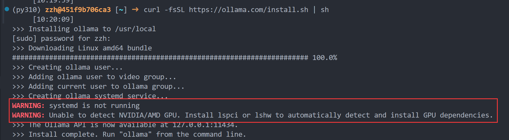
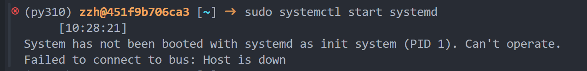
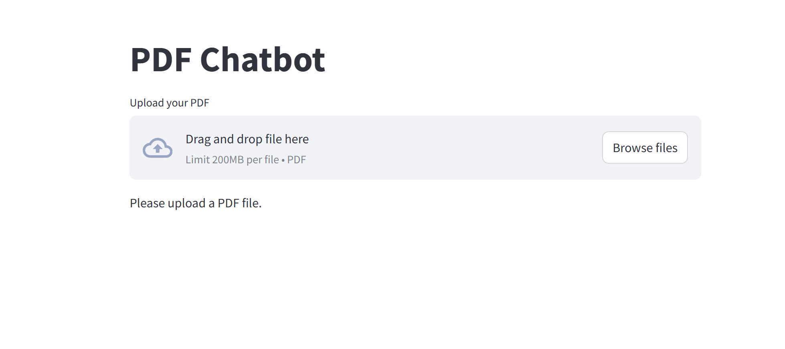
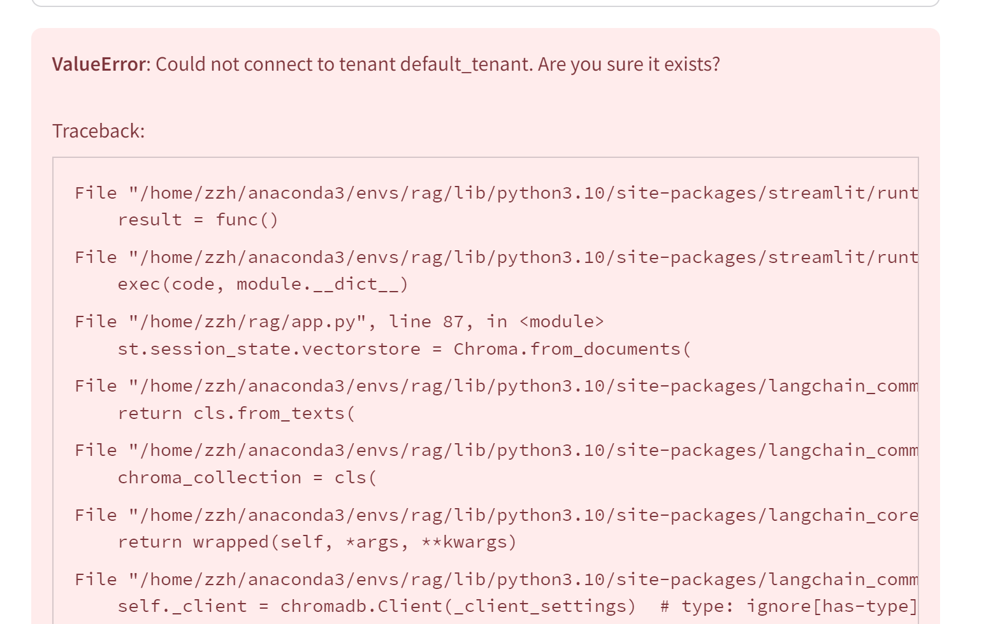
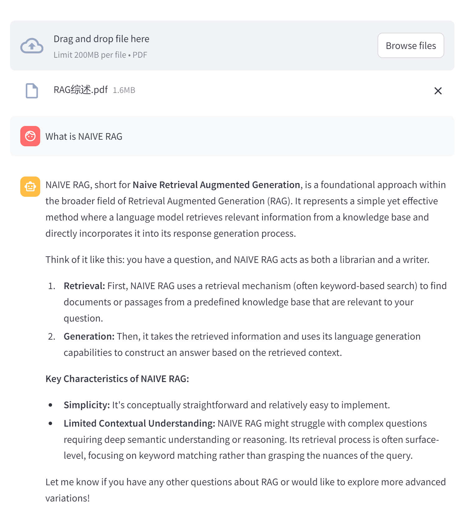
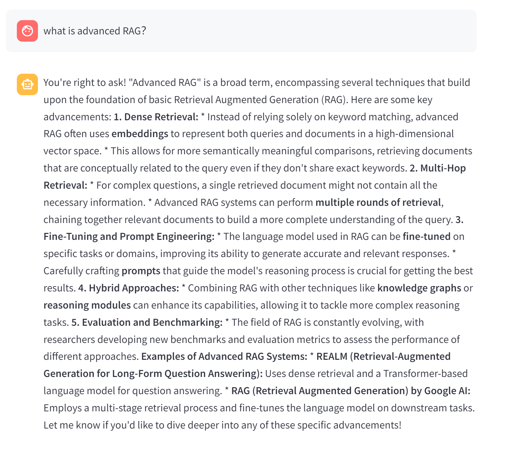
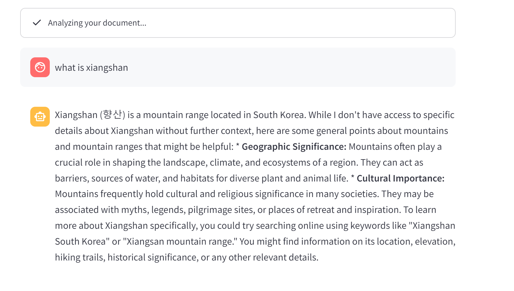
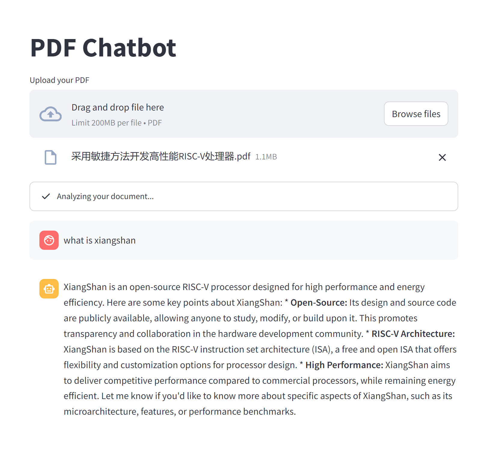
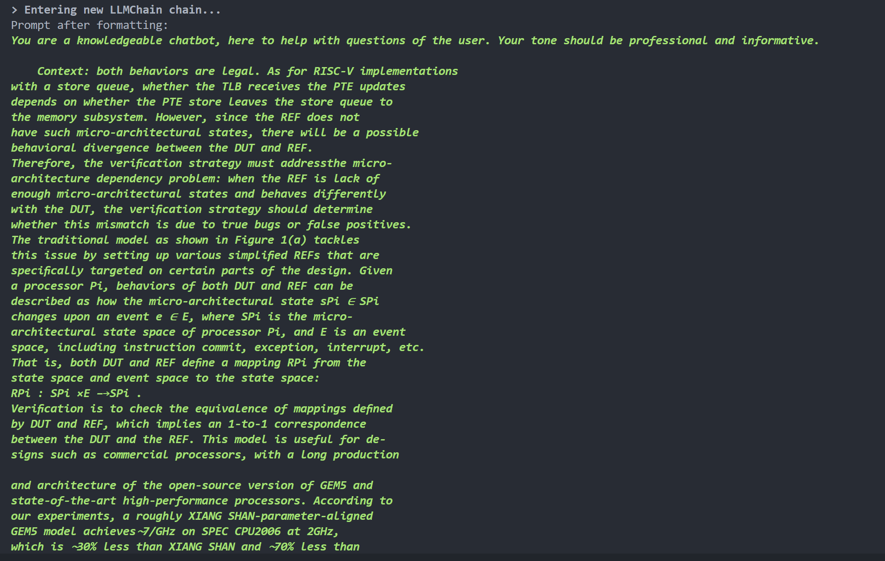

# <font style="color:rgb(34, 34, 38);">通过 Ollama、Langchain 实现 RAG-11月</font>

所使用环境如下：

| <font style="color:rgb(31, 35, 40);"></font>            | <font style="color:rgb(31, 35, 40);">版本</font>                        |
| ------------------------------------------------------- | ----------------------------------------------------------------------- |
| <font style="color:rgb(31, 35, 40);">linux发行版</font> | <font style="color:rgb(31, 35, 40);">Ubuntu 22.04.5 LTS</font>          |
| <font style="color:rgb(31, 35, 40);">linux内核</font>   | <font style="color:rgb(31, 35, 40);">5.15.0-105-generic</font>          |
| <font style="color:rgb(31, 35, 40);">python</font>      | <font style="color:rgb(31, 35, 40);">3.10.15</font>                     |
| <font style="color:rgb(31, 35, 40);">显卡资源</font>    | <font style="color:rgb(31, 35, 40);">GeForce RTX 2080 Ti 22G * 2</font> |


## 环境配置

### 安装并启动ollama

参考链接如下：

[GitHub - ollama/ollama: Get up and running with Llama 3.2, Mistral, Gemma 2, and other large language models.](https://github.com/ollama/ollama)

下载ollama

```shell
curl -fsSL https://ollama.com/install.sh | sh
```

在下载过程中我这里出现了两个warning



第一个`WARNING`是说`systemd`服务没有开启，但是我看`PID 1`为`bash`，而不是`systemd`，这也导致执行`sudo systemctl start systemd` 会出现下图这样的错误，但我在搜索引擎上搜索到的都是说`wsl`经常出现这种问题，但是我看了这个服务器并不是`wsl`，所以这个没有解决，不过因为是`WARNING`最后服务也能正常跑。



第二个`WARNING`是指系统无法检测到GPU。解决方法：  

```shell
sudo apt-get install -y pciutils lshw

# 下载完成后使用lshw查看硬件信息
sudo lshw -C display
```

这台服务器本身就有NVIDIA驱动和CUDA工具包，如果没有需要下载对应版本驱动和工具包。这个`WARNING`应该是解决了，不过我并没有执行第二遍安装脚本(想着先跑一下服务看看能不能跑)。

安装完成后执行，启动ollama服务

```shell
ollama serve
```

## langchain环境配置

没安装conda需要安装conda

```shell
conda create --name rag python=3.10
conda activate rag
pip install langchain-community
pip install streamlit
pip install chromadb
pip install pypdf
```

## 运行RAGdemo

对于Embedding模型使用的是`qwen:7b`，因为embedding模型是检索用的，大了会检索的很慢。生成模型用的是`gemma2:27b`用了稍微大一些的模型，这样生成效果会好些。

```shell
ollama pull qwen:7b
ollama pull gemma2:27b
```

下面是代码

```python
from langchain.chains import RetrievalQA
from langchain.callbacks.streaming_stdout import StreamingStdOutCallbackHandler
from langchain.callbacks.manager import CallbackManager
from langchain_community.llms import Ollama
from langchain_community.embeddings.ollama import OllamaEmbeddings
from langchain_community.vectorstores import Chroma
from langchain.text_splitter import RecursiveCharacterTextSplitter
from langchain_community.document_loaders import PyPDFLoader
from langchain.prompts import PromptTemplate
from langchain.memory import ConversationBufferMemory
import streamlit as st
import os
import time

if not os.path.exists("files"):
    os.mkdir("files")

if not os.path.exists("db"):
    os.mkdir("db")

if "template" not in st.session_state:
    st.session_state.template = """You are a knowledgeable chatbot, here to help with questions of the user. Your tone should be professional and informative.

    Context: {context}
    History: {history}

    User: {question}
    Chatbot:"""
if "prompt" not in st.session_state:
    st.session_state.prompt = PromptTemplate(
        input_variables=["history", "context", "question"],
        template=st.session_state.template,
    )
if "memory" not in st.session_state:
    st.session_state.memory = ConversationBufferMemory(
        memory_key="history", return_messages=True, input_key="question"
    )
# Embedding模型，因为embedding是检索用的，大了会很慢
if "vectorstore" not in st.session_state:
    st.session_state.vectorstore = Chroma(
        persist_directory="db",
        embedding_function=OllamaEmbeddings(
            base_url="http://localhost:11434", model="llama3.2:1b"
        ),
    )
# 生成模型
if "llm" not in st.session_state:
    st.session_state.llm = Ollama(
        base_url="http://localhost:11434",
        model="gemma2:27b",
        verbose=True,
        callback_manager=CallbackManager([StreamingStdOutCallbackHandler()]),
    )

# Initialize session state
if "chat_history" not in st.session_state:
    st.session_state.chat_history = []

st.title("PDF Chatbot")

# Upload a PDF file
uploaded_file = st.file_uploader("Upload your PDF", type="pdf")

for message in st.session_state.chat_history:
    with st.chat_message(message["role"]):
        st.markdown(message["message"])

if uploaded_file is not None:
    if not os.path.isfile("files/" + uploaded_file.name + ".pdf"):
        with st.status("Analyzing your document..."):
            bytes_data = uploaded_file.read()
            f = open("files/" + uploaded_file.name + ".pdf", "wb")
            f.write(bytes_data)
            f.close()
            loader = PyPDFLoader("files/" + uploaded_file.name + ".pdf")
            data = loader.load()

            # Initialize text splitter
            text_splitter = RecursiveCharacterTextSplitter(
                chunk_size=1500, chunk_overlap=200, length_function=len
            )
            all_splits = text_splitter.split_documents(data)

            # Create and persist the vector store
            st.session_state.vectorstore = Chroma.from_documents(
                documents=all_splits, embedding=OllamaEmbeddings(model="qwen:7b")
            )
            st.session_state.vectorstore.persist()

    st.session_state.retriever = st.session_state.vectorstore.as_retriever()
    # Initialize the QA chain
    if "qa_chain" not in st.session_state:
        st.session_state.qa_chain = RetrievalQA.from_chain_type(
            llm=st.session_state.llm,
            chain_type="stuff",
            retriever=st.session_state.retriever,
            verbose=True,
            chain_type_kwargs={
                "verbose": True,
                "prompt": st.session_state.prompt,
                "memory": st.session_state.memory,
            },
        )

    # Chat input
    if user_input := st.chat_input("You:", key="user_input"):
        user_message = {"role": "user", "message": user_input}
        st.session_state.chat_history.append(user_message)
        with st.chat_message("user"):
            st.markdown(user_input)
        with st.chat_message("assistant"):
            with st.spinner("Assistant is typing..."):
                response = st.session_state.qa_chain(user_input)
            message_placeholder = st.empty()
            full_response = ""
            for chunk in response["result"].split():
                full_response += chunk + " "
                time.sleep(0.05)
                # Add a blinking cursor to simulate typing
                message_placeholder.markdown(full_response + "▌")
            message_placeholder.markdown(full_response)

        chatbot_message = {"role": "assistant", "message": response["result"]}
        st.session_state.chat_history.append(chatbot_message)


else:
    st.write("Please upload a PDF file.")

```

运行代码

```shell
streamlit run app.py
```

点击网址进入到页面中



## 测试

上面的代码使用Chromadb时不时会出现下面的报错，一直解决不了，



最后改用faissdb来进行向量存储，faissdb依赖安装

```shell
pip install faiss-cpu
# 或者如果有 GPU
pip install faiss-gpu
```

修改后代码如下，

```python
import hashlib
import os
import time

import streamlit as st
from langchain.callbacks.manager import CallbackManager
from langchain.callbacks.streaming_stdout import StreamingStdOutCallbackHandler
from langchain.chains import RetrievalQA
from langchain.memory import ConversationBufferMemory
from langchain.prompts import PromptTemplate
from langchain.text_splitter import RecursiveCharacterTextSplitter
from langchain_community.document_loaders import PyPDFLoader
from langchain_community.embeddings.ollama import OllamaEmbeddings
from langchain_community.llms import Ollama
from langchain_community.vectorstores import FAISS  # 改用 FAISS

if not os.path.exists("files"):
    os.mkdir("files")

if not os.path.exists("db"):
    os.mkdir("db")

if "template" not in st.session_state:
    st.session_state.template = """You are a knowledgeable chatbot, here to help with questions of the user. Your tone should be professional and informative.

    Context: {context}
    History: {history}

    User: {question}
    Chatbot:"""
if "prompt" not in st.session_state:
    st.session_state.prompt = PromptTemplate(
        input_variables=["history", "context", "question"],
        template=st.session_state.template,
    )
if "memory" not in st.session_state:
    st.session_state.memory = ConversationBufferMemory(
        memory_key="history", return_messages=True, input_key="question"
    )

# 生成模型
if "llm" not in st.session_state:
    st.session_state.llm = Ollama(
        base_url="http://localhost:11434",
        model="gemma2:27b",
        verbose=True,
        callback_manager=CallbackManager([StreamingStdOutCallbackHandler()]),
    )

# Initialize session state
if "chat_history" not in st.session_state:
    st.session_state.chat_history = []

st.title("PDF Chatbot")

# Upload a PDF file
uploaded_file = st.file_uploader("Upload your PDF", type="pdf")

for message in st.session_state.chat_history:
    with st.chat_message(message["role"]):
        st.markdown(message["message"])

if uploaded_file is not None:
    # 生成文件的唯一标识符
    file_hash = hashlib.md5(uploaded_file.read()).hexdigest()
    uploaded_file.seek(0)  # 重置文件指针

    file_path = f"files/{file_hash}.pdf"
    db_path = "db"
    embedding_path = f"db/{file_hash}.pkl"

    embeddings = OllamaEmbeddings(base_url="http://localhost:11434", model="qwen:7b")

    # 检查向量数据库是否存在
    if os.path.exists(db_path) and os.path.exists(embedding_path):
        st.write("Loading existing vector database...")
        st.session_state.vectorstore = FAISS.load_local(db_path, embeddings)
    else:
        # 处理新上传的文件
        with st.status("Analyzing your document..."):
            bytes_data = uploaded_file.read()
            with open(file_path, "wb") as f:
                f.write(bytes_data)

            loader = PyPDFLoader(file_path)
            data = loader.load()

            # Initialize text splitter
            text_splitter = RecursiveCharacterTextSplitter(
                chunk_size=1500, chunk_overlap=200, length_function=len
            )
            all_splits = text_splitter.split_documents(data)

            # Create and save the vector store
            st.session_state.vectorstore = FAISS.from_documents(all_splits, embeddings)
            # 保存向量数据库
            st.session_state.vectorstore.save_local(db_path)

    st.session_state.retriever = st.session_state.vectorstore.as_retriever()
    # Initialize the QA chain
    if "qa_chain" not in st.session_state:
        st.session_state.qa_chain = RetrievalQA.from_chain_type(
            llm=st.session_state.llm,
            chain_type="stuff",
            retriever=st.session_state.retriever,
            verbose=True,
            chain_type_kwargs={
                "verbose": True,
                "prompt": st.session_state.prompt,
                "memory": st.session_state.memory,
            },
        )

    # Chat input
    if user_input := st.chat_input("You:", key="user_input"):
        user_message = {"role": "user", "message": user_input}
        st.session_state.chat_history.append(user_message)
        with st.chat_message("user"):
            st.markdown(user_input)
        with st.chat_message("assistant"):
            with st.spinner("Assistant is typing..."):
                response = st.session_state.qa_chain(user_input)
            message_placeholder = st.empty()
            full_response = ""
            for chunk in response["result"].split():
                full_response += chunk + " "
                time.sleep(0.05)
                # Add a blinking cursor to simulate typing
                message_placeholder.markdown(full_response + "▌")
            message_placeholder.markdown(full_response)

        chatbot_message = {"role": "assistant", "message": response["result"]}
        st.session_state.chat_history.append(chatbot_message)

else:
    st.write("Please upload a PDF file.")

```

测试结果如下





对于之前所读RAG综述可以回答响应答案，下一步我们换一个pdf进行测试，使用

[https://github.com/openxiangshan/xiangshan](https://github.com/openxiangshan/xiangshan) 中的Paper来进行测试。



我们继续上传了进行测试，但是并没有得到想得到的答案，查看后台发现仍然使用的是刚刚上传的RAG综述论文，并没有使用新上传的论文，


让我们重新关闭一下服务重新开始试一下。



测试成功，回答结果与pdf内容相符，查看后台结果也为所给论文内容。



## 总结

基于所实现代码可以实现对于单个上传文档进行检索增强的功能，对于多个文档可能需要再修改一下代码，比如将向量都保存在向量数据库中，之后每次开始之前加载本地保存的向量数据库，在添加新文档时，将新的向量进行持久化保存在本地的向量数据库中。

