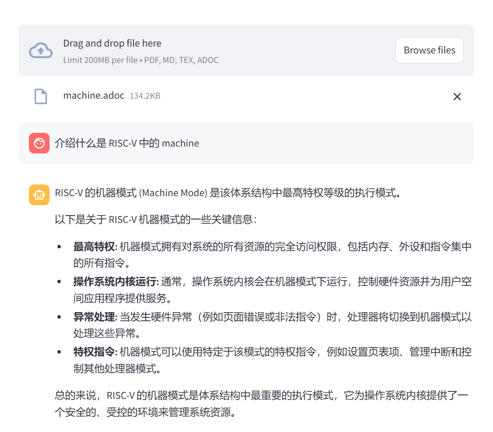
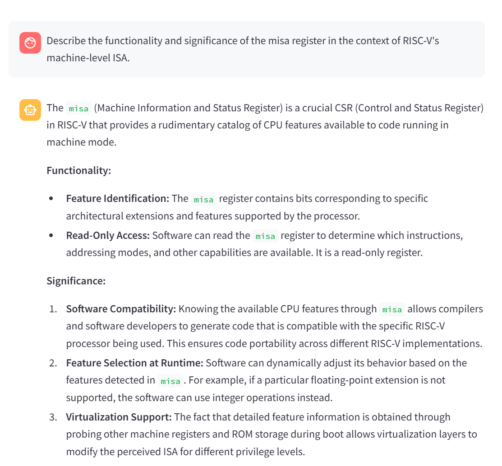
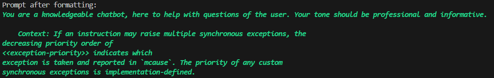

# 11 月实习工作记录


## 工作月报

##### MULTI RAG

张同学在实习所给的服务器上，使用 `langchain`  框架实现了对单个 PDF 文档的向量化存储功能和文档的分块与检索，集成了 `Qwen:7b` 作为 Embedding 模型进行检索和 `Gemma2:27b` 作为生成模型进行回答的生成，并使用 `streamlit` 实现用户交互的界面。但是这个 RAG 系统存在输入来源单一的问题，只支持 PDF 解析。

注意到，`RustSBI  Agent` 的领域知识来源之一 `RISC-V Unprivileged RISC-V Instruction Set Manual` 在其源 `GitHub` 仓库中主要以 `AsciiDoc` 格式存储。为了提高 `RustSBI Agent` 回答 `RISC-V` 相关问题的能力，支持解析 `AsciiDoc` 格式文档，因此进行了相应的代码改进和功能扩展。

---

## AsciiDoc 格式解析

#### **1. 什么是 AsciiDoc？**

AsciiDoc 是一种轻量级的文档标记语言，专为撰写技术文档而设计。它具有类似 Markdown 的语法简洁性，同时支持更复杂的文档结构和排版需求。AsciiDoc 文档可以轻松转换为 HTML、PDF、EPUB 等格式，适用于书籍、手册、API 文档和技术报告。

#### **2. 核心语法概述**

##### **(1) 标题**

通过 `=` 符号表示标题层级：

```adoc
= 一级标题
== 二级标题
=== 三级标题
==== 四级标题
```

##### **(2) 段落**

普通段落直接书写：

```adoc
普通段落直接输入文字即可。
```

##### **(3) 列表**

支持有序列表和无序列表：

- 无序列表

  ```adoc
  * 无序项 1
  * 无序项 2
  ** 嵌套无序项
  ```

- 有序列表

  ```adoc
  . 有序项 1
  . 有序项 2
  .. 嵌套有序项
  ```

##### **(4) 链接与图像**

- 超链接

  ```adoc
  http://example.com[链接文字]
  ```

- 嵌入图像

  ```adoc
  image::path/to/image.png[图片描述]
  ```

##### **(5) 代码块**

支持嵌入代码块，语法如下：

```adoc
[source,python]
----
def hello_world():
    print("Hello, AsciiDoc!")
----
```

##### **(6) 表格**

```adoc
|===
| 列 1 | 列 2 | 列 3
| 数据 1 | 数据 2 | 数据 3
| 数据 4 | 数据 5 | 数据 6
|===
```

##### **(7) 块引用**

```adoc
[quote, 作者]
____
这是引用的内容。
____
```

##### **(8) 文档元信息**

AsciiDoc 支持设置文档属性：

```adoc
:author: 作者姓名
:revnumber: 1.0
:revdate: 2024-11-22
```

#### **3. 需注意特性**

1. **层级划分**：`AsciiDoc` 使用 `=` 符号划分标题层级，`Chunk` 划分可以以此为依据。
2. **跨平台转换**：可通过工具（如 `asciidoctor`）快速转换为 HTML、PDF 等多种格式。
3. **模块化**：`AsciiDoc` 支持 `include::` 指令引用外部文件，方便维护大规模文档，但是使用 `asciidoctor` 时需要注意缺失外部文件会导致解析失败。

---

## Multi RAG 升级报告

### 环境配置

使用环境如下：

| 资源         | 版本                        |
| ------------ | --------------------------- |
| linux 发行版 | Ubuntu 22.04.5 LTS          |
| linux 内核   | 5.15.0-105-generic          |
| python       | 3.10.15                     |
| 显卡         | GeForce RTX 2080 Ti 22G * 2 |

`ollama`、`conda` 的配置和预训练模型下载见 [11月工作笔记](https://github.com/rustsbi/Agent/blob/main/rfcs/November-notes-by-zzh.md)。

### 基础代码

钟同学工作产出的基础代码如下：

```python
import hashlib
import os
import time

import streamlit as st
from langchain.callbacks.manager import CallbackManager
from langchain.callbacks.streaming_stdout import StreamingStdOutCallbackHandler
from langchain.chains import RetrievalQA
from langchain.memory import ConversationBufferMemory
from langchain.prompts import PromptTemplate
from langchain.text_splitter import RecursiveCharacterTextSplitter
from langchain_community.document_loaders import PyPDFLoader
from langchain_community.embeddings.ollama import OllamaEmbeddings
from langchain_community.llms import Ollama
from langchain_community.vectorstores import FAISS  # 改用 FAISS

if not os.path.exists("files"):
    os.mkdir("files")

if not os.path.exists("db"):
    os.mkdir("db")

if "template" not in st.session_state:
    st.session_state.template = """You are a knowledgeable chatbot, here to help with questions of the user. Your tone should be professional and informative.

    Context: {context}
    History: {history}

    User: {question}
    Chatbot:"""
if "prompt" not in st.session_state:
    st.session_state.prompt = PromptTemplate(
        input_variables=["history", "context", "question"],
        template=st.session_state.template,
    )
if "memory" not in st.session_state:
    st.session_state.memory = ConversationBufferMemory(
        memory_key="history", return_messages=True, input_key="question"
    )

# 生成模型
if "llm" not in st.session_state:
    st.session_state.llm = Ollama(
        base_url="http://localhost:11434",
        model="gemma2:27b",
        verbose=True,
        callback_manager=CallbackManager([StreamingStdOutCallbackHandler()]),
    )

# Initialize session state
if "chat_history" not in st.session_state:
    st.session_state.chat_history = []

st.title("PDF Chatbot")

# Upload a PDF file
uploaded_file = st.file_uploader("Upload your PDF", type="pdf")

for message in st.session_state.chat_history:
    with st.chat_message(message["role"]):
        st.markdown(message["message"])

if uploaded_file is not None:
    # 生成文件的唯一标识符
    file_hash = hashlib.md5(uploaded_file.read()).hexdigest()
    uploaded_file.seek(0)  # 重置文件指针

    file_path = f"files/{file_hash}.pdf"
    db_path = "db"
    embedding_path = f"db/{file_hash}.pkl"

    embeddings = OllamaEmbeddings(base_url="http://localhost:11434", model="qwen:7b")

    # 检查向量数据库是否存在
    if os.path.exists(db_path) and os.path.exists(embedding_path):
        st.write("Loading existing vector database...")
        st.session_state.vectorstore = FAISS.load_local(db_path, embeddings)
    else:
        # 处理新上传的文件
        with st.status("Analyzing your document..."):
            bytes_data = uploaded_file.read()
            with open(file_path, "wb") as f:
                f.write(bytes_data)

            loader = PyPDFLoader(file_path)
            data = loader.load()

            # Initialize text splitter
            text_splitter = RecursiveCharacterTextSplitter(
                chunk_size=1500, chunk_overlap=200, length_function=len
            )
            all_splits = text_splitter.split_documents(data)

            # Create and save the vector store
            st.session_state.vectorstore = FAISS.from_documents(all_splits, embeddings)
            # 保存向量数据库
            st.session_state.vectorstore.save_local(db_path)

    st.session_state.retriever = st.session_state.vectorstore.as_retriever()
    # Initialize the QA chain
    if "qa_chain" not in st.session_state:
        st.session_state.qa_chain = RetrievalQA.from_chain_type(
            llm=st.session_state.llm,
            chain_type="stuff",
            retriever=st.session_state.retriever,
            verbose=True,
            chain_type_kwargs={
                "verbose": True,
                "prompt": st.session_state.prompt,
                "memory": st.session_state.memory,
            },
        )

    # Chat input
    if user_input := st.chat_input("You:", key="user_input"):
        user_message = {"role": "user", "message": user_input}
        st.session_state.chat_history.append(user_message)
        with st.chat_message("user"):
            st.markdown(user_input)
        with st.chat_message("assistant"):
            with st.spinner("Assistant is typing..."):
                response = st.session_state.qa_chain(user_input)
            message_placeholder = st.empty()
            full_response = ""
            for chunk in response["result"].split():
                full_response += chunk + " "
                time.sleep(0.05)
                # Add a blinking cursor to simulate typing
                message_placeholder.markdown(full_response + "▌")
            message_placeholder.markdown(full_response)

        chatbot_message = {"role": "assistant", "message": response["result"]}
        st.session_state.chat_history.append(chatbot_message)

else:
    st.write("Please upload a PDF file.")
```

该代码完成了以下工作：

1. 前端界面的选择与部署；
2. PDF 文件的上传和解析；
   - 对于新上传的文件，使用 `PyPDFLoader` 解析 PDF 内容。
   - 通过 `RecursiveCharacterTextSplitter` 将长文本分块处理，便于后续的嵌入生成和检索操作。
3. 嵌入生成与向量数据库保存；
   - 利用 `OllamaEmbeddings` 生成文本块的嵌入向量。
   - 将嵌入向量存储到 FAISS 向量数据库。
4. 构建 RAG 流程，进行用户问答。

### 代码改进

#### 1. asciidoctor 方案

`asciidoctor` 是一个成熟的 AsciiDoc 解析器，支持全面的 AsciiDoc 语法，并且具有较强的性能和稳定性。查阅了网络上关于 AsciiDoc 的解析方案后，我尝试通过调用 asciidoctor 命令行接口（CLI）来解析 AsciiDoc 文件。

源代码如下：

```python
import subprocess

def parse_adoc_with_asciidoctor(file_path):
    try:
        # 使用 asciidoctor 将文档转换为 HTML 格式
        result = subprocess.run(
            ["asciidoctor", "--backend=html5", file_path],
            capture_output=True,
            text=True,
            check=True,
        )
        return result.stdout  # 返回解析后的 HTML 内容
    except subprocess.CalledProcessError as e:
        print(f"Error parsing AsciiDoc: {e.stderr}")
        return None
```

##### **遇到的问题**

```
asciidoctor --backend=docbook ./riscv-machine.adoc
asciidoctor: ERROR: riscv-machine.adoc: line 24: include file not found: 
```

- 当文档中存在 `include::` 指令时，若引用文件缺失，asciidoctor 会直接报错并终止运行，缺乏优雅的降级处理机制。同时，观察来自 RISC-V Manual 的 adoc 文件，其中大量存在该指令，无法通过识别文档头部的方式去除。因此重新选择方案。

#### 2. 直接解析方案

由第二部分，`AsciiDoc` 格式解析可知，adoc 文档的层次结构并不复杂，对于表格含量较少的文档，采用标题符号 ”=“ 号就可以较好地区分文档中的各个部分。因此，考虑自行撰写一个轻量级解析器，利用正则表达式解析 AsciiDoc 文档的核心结构。

源代码如下：

```python
import re

def parse_adoc(file_path):
    """Parse Asciidoc file and split content into chunks based on structure."""
    try:
        with open(file_path, "r", encoding="utf-8") as f:
            lines = f.readlines()
    except FileNotFoundError:
        raise ValueError(f"File not found: {file_path}")

    chunks = []
    current_chunk = []
    current_title = None

    for line in lines:
        # Ignore include directives and blank lines
        if line.strip().startswith("include::") or not line.strip():
            continue

        # Detect titles (e.g., = Title, == Subtitle)
        title_match = re.match(r"^(=+)\s+(.*)", line)
        if title_match:
            # Save the previous chunk if any
            if current_chunk:
                chunks.append({
                    "title": current_title or {"level": 0, "title": "No Title"},
                    "content": "\n".join(current_chunk)
                })
                current_chunk = []

            # Update current title
            level, title = title_match.groups()
            current_title = {"level": len(level), "title": title.strip()}
        else:
            # Append content to the current chunk
            current_chunk.append(line.strip())

    # Save the last chunk
    if current_chunk:
        chunks.append({
            "title": current_title or {"level": 0, "title": "No Title"},
            "content": "\n".join(current_chunk)
        })

    return chunks
```

上述代码成功完成了 AsciiDoc 格式的文档解析功能。

### 运行测试

采用 [riscv-machine.adoc](https://github.com/riscv/riscv-isa-manual/blob/main/src/machine.adoc) 作为输入文档进行测试：







测试结果显示，传入的 adoc 文档成功被解析，并应用于 RAG 问答流程中，检索和回答结果较为准确，增强了系统处理特定技术文档的能力。未来将进一步完善 RAG 系统，增加更多对其他格式解析的支持。