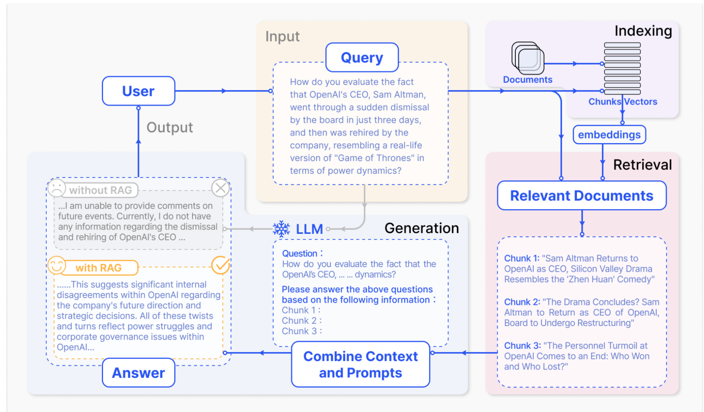
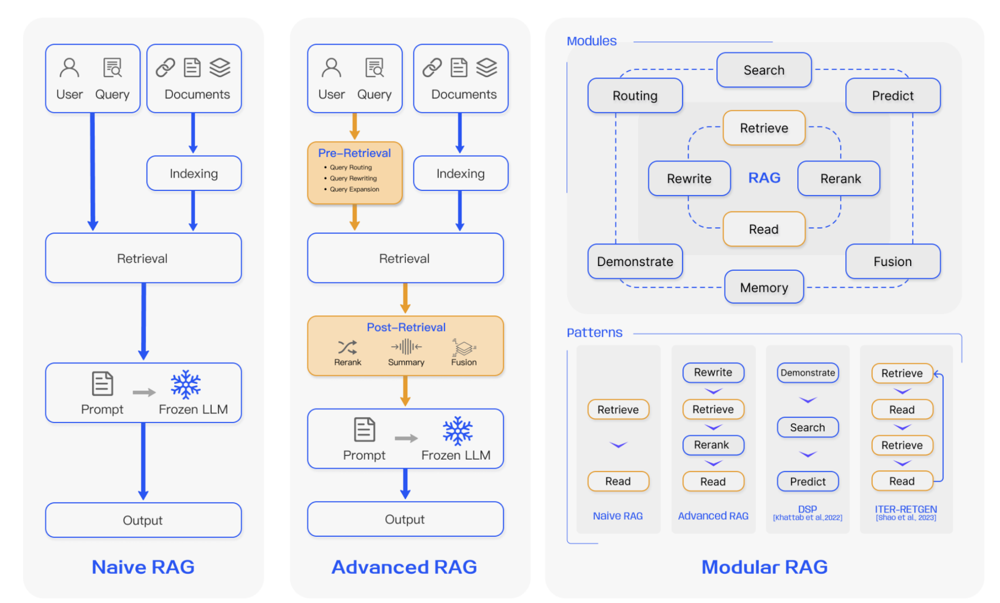
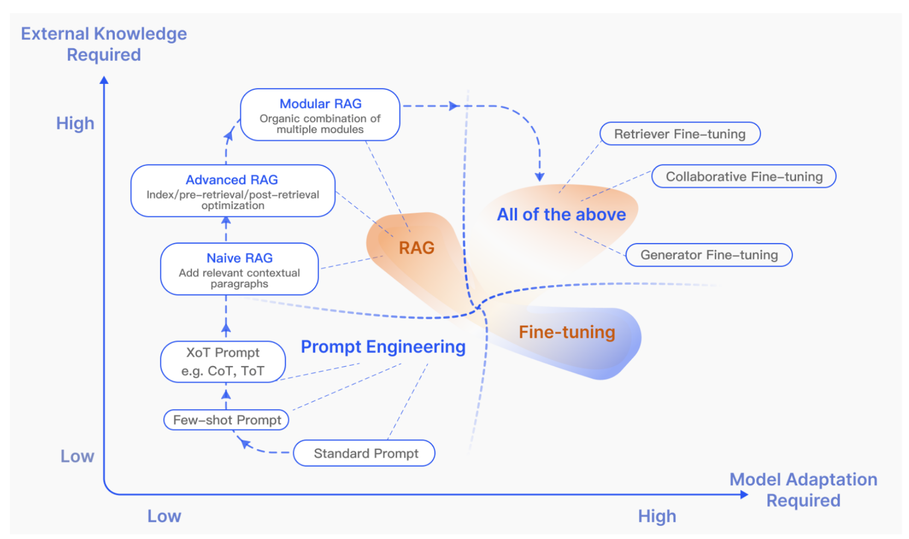
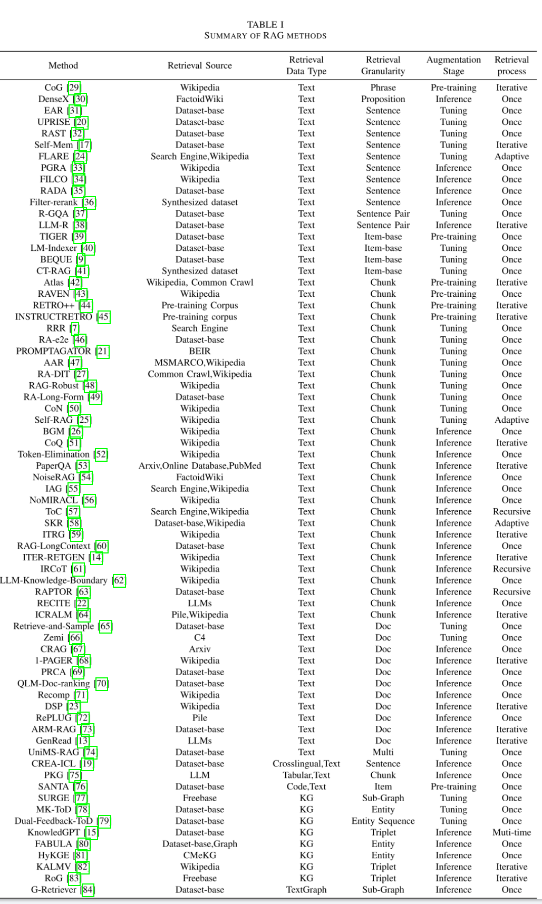
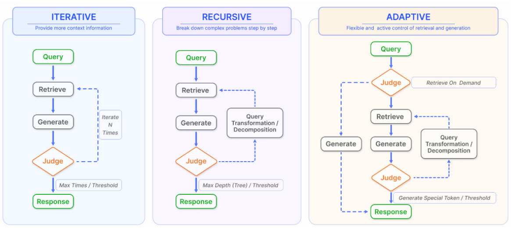
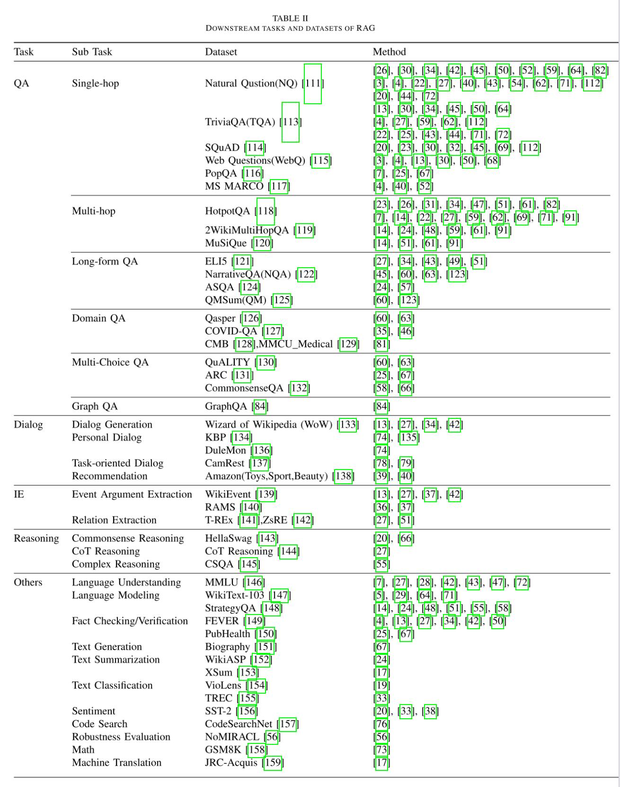
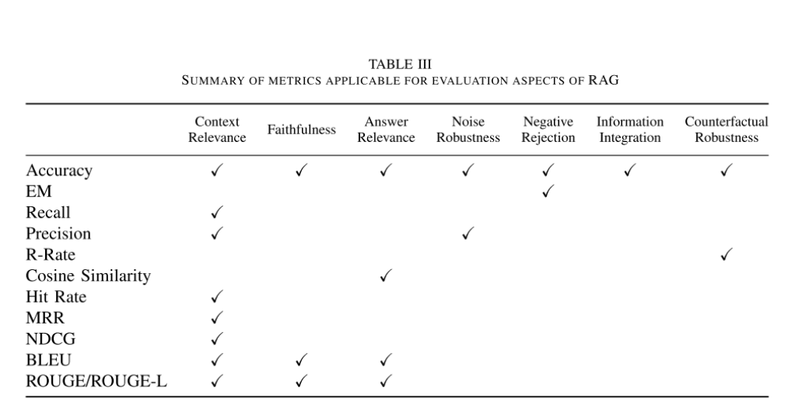
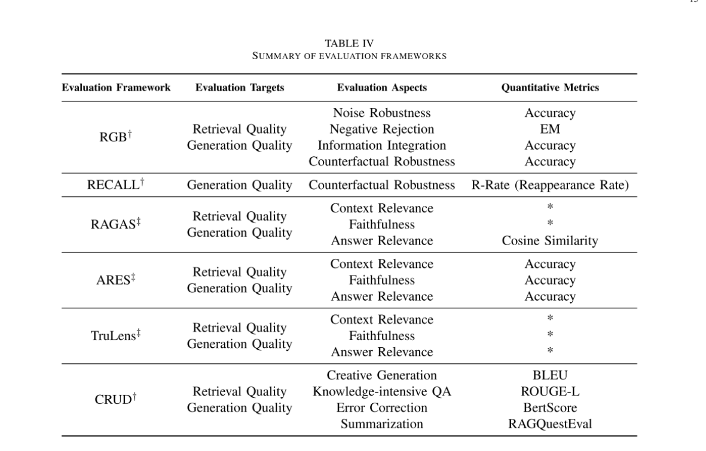
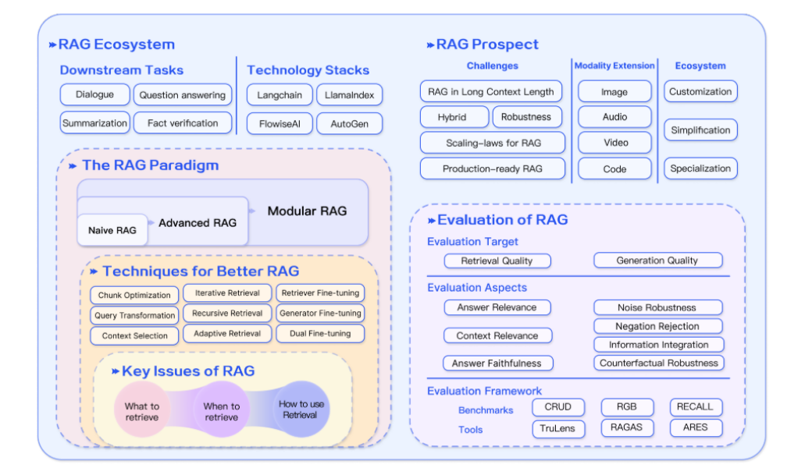

# RAG论文综述-10月

[https://arxiv.org/pdf/2312.10997](https://arxiv.org/pdf/2312.10997)  下面是边读边翻译的正文

## 导言

检索增强生成（RAG）可以用来应对大语言模型所遇到的一些挑战比如幻觉，过时的知识和不透明，不可追踪的推理过程等。RAG范式的进展，包括朴素RAG(Naive RAG)、高级RAG(Advanced RAG)和模块化RAG(Modular RAG)，RAG框架的三个组成部分为：检索技术(retrieval)、生成技术(generation)、扩充技术(augmentation techniques)。

LLM在特定领域或者知识密集型任务中，当处理超过其训练数据或者需要当前信息的查询时，会产生明显的“幻觉”。检索增强生成（Retrieval-Augmented Generation，RAG）通过语义相似度计算，从外部知识库中检索相关文档块，从而增强了LLM。通过引用外部知识，RAG有效地减少了生成事实上不正确的内容的问题。

## RAG概览

RAG的一个典型应用如下图所示。在这里，一个用户向ChatGPT提出了一个关于最近广泛讨论的新闻的问题。由于ChatGPT依赖于预培训数据，因此最初缺乏提供最新发展更新的能力。RAG通过从外部数据库中获取和整合知识来弥补这一信息差距。在这种情况下，它会收集与用户查询相关的新闻文章。这些文章与原始问题结合在一起，形成了一个全面的提示，使LLM能够得出一个充分知情的答案。

RAG研究范式在不断发展，将其分为三个阶段：初级RAG、高级RAG和模块化RAG，如下图所示。

### Naive RAG

Naive RAG遵循包括索引、检索和生成的传统过程，其特征也是“检索-读取”框架。[7][X. Ma, Y. Gong, P. He, H. Zhao, and N. Duan, “Query rewriting for retrieval-augmented large language models,” arXiv preprint arXiv:2305.14283, 2023.]

索引，从清除和提取PDF、HTML、Word和Markdown等各种格式的原始数据开始，然后将其转换为统一的纯文本格式。为了适应语言模型的上下文限制，文本被分割成较小的、可理解的块。然后，使用嵌入模型将块编码为矢量表示，并存储在矢量数据库中。该步骤对于在后续检索阶段中实现高效的相似性搜索是至关重要的。

检索，在接收到用户查询时，RAG系统采用与在索引阶段期间所利用的编码模型相同的编码模型来将查询变换成矢量表示。然后，它计算查询向量和索引的语料库内的块向量之间的相似性得分。系统会优先检索与查询相似度最高的 K 个数据块。这些块随后将用作提示中的扩展上下文。

生成，提出的查询和选定的文档被合成为一个连贯的提示，而大型语言模型的任务就是对此作出回应。该模型的回答方法可根据特定任务的标准而有所不同，允许它利用其固有的参数知识，或将其回答限制在所提供文档中包含的信息范围内。在持续对话的情况下，任何现有的对话历史记录都可以整合到提示中，从而使模型能够有效地参与多轮对话互动。

Naive RAG也具有明显缺点：

检索挑战。检索阶段经常会在精确度和召回率方面遇到困难，导致选择错位或不相关的信息块，以及丢失关键信息。

生成困难。在生成回复时，模型可能会遇到幻觉问题，即生成的内容与检索到的上下文不符。这一阶段还可能出现输出内容不相关、有毒或有偏差的情况，从而影响回复的质量和可靠性。

增强障碍。将检索到的信息与不同的任务进行整合可能具有挑战性，有时会导致输出结果脱节或不连贯。当从多个来源检索到类似信息时，这一过程还可能遇到冗余问题，从而导致重复性回答。确定不同段落的意义和相关性，并确保文体和音调的一致性，这些都增加了工作的复杂性。面对复杂的问题，基于原始查询的单一检索可能不足以获取足够的上下文信息。

此外，还有人担心，生成模型可能会过度依赖增强信息，导致输出结果只是重复检索到的内容，而没有增加有见地的或综合的信息。

### Advanced RAG

高级 RAG 引入了具体的改进措施，以克服 Naive RAG 的局限性。为了提高检索质量，它采用了检索前和检索后策略。为了解决索引问题，高级 RAG 通过使用滑动窗口方法、细粒度分割和元数据的整合，改进了索引技术。此外，它还采用了多种优化方法来简化检索过程[[8](https://pub.towardsai.net/advanced-rag-techniques-an-illustrated-overview-04d193d8fec6)]。

预检索过程。在这一阶段，主要重点是优化索引结构和原始查询。优化索引的目标是提高索引内容的质量。这涉及以下策略：提高数据粒度、优化索引结构、添加元数据、优化排列和混合检索。而查询优化的目标是使用户的原始问题更清晰、更适合检索任务。常见的方法包括查询重写查询转换、查询扩展等技术[7], [9]-[11]。

检索后流程。检索到相关上下文后，将其与查询有效地集成是至关重要的。后检索过程中的主要方法包括重排组块和上下文压缩。对检索到的信息进行重新排序以将最相关的内容重新定位到提示的边缘是一个关键策略。这一概念已经在[LlamaIndex](https://www.llamaindex.ai)、[LangChain](https://www.langchain.com/)和Hystack[[12](https://towardsdatascience.com/%20enhancing-rag-pipelines-in-haystack-45f14e2bc9f5)]等框架中实现。将所有相关文档直接送入LLMs可能会导致信息过载，稀释对包含无关内容的关键细节的关注。为了缓解这一问题，检索后的工作集中于选择重要信息、强调关键部分和缩短要处理的上下文。

### Modular RAG

模块化RAG架构超越了前两种RAG范式，提供了增强的适应性和多功能性。它结合了各种改进组件的策略，例如添加一个用于相似性搜索的搜索模块，以及通过微调来改进检索器。为了应对具体挑战，已经引入了重组的RAG模块[13]和重新排列的RAG管道[14]等创新。向模块化RAG方法的转变正变得越来越普遍，它同时支持顺序处理和跨其组件的集成端到端培训。尽管其独特性，模块化的RAG建立在先进的和幼稚的RAG的基本原则，说明了RAG的进步和完善。

#### 新模块

模块化RAG框架引入了额外的专门组件，以增强检索和处理能力。搜索模块适应特定的场景，使用LLM生成的代码和查询语言，支持跨各种数据源（如搜索引擎、数据库和知识图）的直接搜索[15]。**RAGFusion模块**通过采用多查询策略将用户查询扩展到不同的角度来解决传统的搜索限制，利用并行矢量搜索和智能重新排序来揭示显式(explicit)和变革性(transformative)知识[16]。内存模块利用LLM的内存来指导检索，创建一个无限的内存池，通过迭代的自我增强使文本与数据分布更紧密地对齐[17]，[18]。RAG系统中的路由在不同的数据源中导航，为查询选择最佳路径，无论它涉及汇总、特定的数据库搜索还是合并不同的信息流[19]。**Predict模块**旨在通过LLM直接生成上下文来减少冗余和噪声，确保相关性和准确性[13]。最后，任务适配器模块使RAG适应各种下游任务，自动化零触发输入的提示检索，并通过少触发查询生成来创建特定于任务的检索器[20]、[21]。这种综合方法不仅简化了检索过程，而且显著提高了检索信息的质量和相关性。以更高的精确度和灵活性满足广泛的任务和查询。

#### 新模式

模块化 RAG 允许模块替换或重新配置，以应对特定挑战，因而具有出色的适应性。这超越了以简单的 “检索 ”和 “读取 ”机制为特征的原始和高级 RAG 的固定结构。此外，模块化 RAG 还可通过集成新模块或调整现有模块之间的交互流程来扩展这种灵活性，从而增强其在不同任务中的适用性。

模块排列和交互的调整，如演示-搜索-预测（DSP）[23]框架和ITERRETGEN [14]的迭代检索-读取-检索-读取流程，展示了模块输出的动态使用，以支持另一个模块的功能，说明了对增强模块协同作用的复杂理解。模块化RAG流的灵活编排展示了通过FLARE [24]和Self-RAG [25]等技术进行自适应检索的优势。该方法通过基于不同场景评估检索的必要性，超越了固定的RAG检索过程。灵活架构的另一个好处是，RAG系统可以更容易地与其他技术集成（如微调(Fine-tuning)或强化学习）[26]。例如，这可能涉及微调检索器以获得更好的检索结果，微调生成器以获得更个性化的输出，或参与协作式微调[27]。

#### RAG vs Fine-tuning

由于 LLM 越来越普遍，增强 LLM 引起了广泛关注。在 LLM 的优化方法中，RAG 经常与微调（FT）和快速工程进行比较。如下图所示，

每种方法都有不同的特点。我们使用象限图从外部知识要求和模型适应性要求两个维度来说明三种方法之间的差异。即时工程利用模型的固有功能，对外部知识和模型调整的需求最小。RAG 可以比作为模型提供量身定做的信息检索教科书，是精确信息检索任务的理想选择。相比之下，FT 就好比学生在长期学习过程中内化知识，适用于需要复制特定结构、风格或格式的场景。

RAG通过提供实时知识更新和有效利用具有高度可解释性的外部知识源，在动态环境中表现出色。然而，它伴随着更高的延迟和有关数据检索的道德考虑。另一方面，FT是更静态的，需要重新训练以进行更新，但允许对模型的行为和风格进行深度定制。它需要大量的计算资源来准备和训练数据集，虽然它可以减少幻觉，但它可能会面临不熟悉的数据的挑战。

在对他们在不同主题的各种知识密集型任务中的表现进行的多次评估中，[28]显示，尽管无监督的微调显示出一些改进，但RAG在训练过程中遇到的现有知识和全新知识方面始终优于它。此外，研究发现，LLM很难通过无监督的微调来学习新的事实信息。在RAG和FT之间的选择取决于应用程序上下文中对数据动态性、定制和计算能力的特定需求。RAG和FT并不相互排斥，可以相互补充，在不同层面上增强模型的能力。在某些情况下，它们的组合使用可能导致最佳性能。涉及RAG和FT的优化过程可能需要多次迭代以获得满意的结果。

## 检索(RETRIEVAL)

在RAG的上下文中，从数据源中高效地检索相关文档是至关重要的。其中涉及到检索源、检索粒度、检索预处理以及嵌入模型的选择等关键问题。

### 检索源

RAG依赖外部知识来增强LLM，而检索源的类型和检索单元的粒度都影响最终的生成结果。

数据结构：最初，文本是检索的主流数据源。随后，检索源扩展为包括半结构化数据（PDF）和结构化数据（Knowledge Graph，KG）以进行增强。除了从原始的外部来源进行检索之外，在最近的研究中也有一个增长的趋势，即利用LLMs自己生成的内容进行检索和增强。

**文本等非结构化数据**是目前应用最广泛的检索源，它们主要是从语料库中获取的。对于开放域问答（ODQA）任务，主要检索源是维基百科转储，当前主要版本包括[HotpotQA](https://hotpotqa.github.io/wiki-readme.html)（2017年10月1日）、[DPR](https://github.com/facebookresearch/DPR)（2018年12月20日）。除了非结构化数据，常见的非结构化数据还包括跨语言文本[19]和特定领域数据（如医疗[67]和法律的领域[29]）。

**半结构化的数据**。通常是指包含文字和表格信息组合的数据，例如PDF。由于两个主要原因，处理半结构化数据对传统RAG系统提出了挑战。首先，文本拆分过程可能会无意中分离表，导致检索期间数据损坏。其次，将表合并到数据中会使语义相似性搜索复杂化。当处理半结构化数据时，一种方法涉及利用LLM的代码能力来对数据库内的表执行Text-2-SQL查询，例如TableGPT [85]。或者，可将表格转换为文本格式，以便使用基于文本的方法进行进一步分析[75]。然而，这两种方法都不是最佳解决方案，这表明在该领域存在大量研究机会。

**结构化数据**，如知识图（KG）[86]，通常经过验证，可以提供更精确的信息。KnowledGPT [15]生成知识库搜索查询并将知识存储在个性化库中，从而增强了RAG模型的知识丰富性。为了应对LLM在理解和回答有关文本图的问题方面的局限性，G-Retriever [84]集成了图神经网络(GNNs)，LLM和RAG，通过LLM的软提示增强图形理解和问答能力，并采用`the Prize-Collecting Steiner Tree（PCST）`优化问题进行有针对性的图形检索。不过，它需要额外的工作来构建、验证和维护结构化数据库。

LLMs生成的内容。针对 RAG 中外部辅助信息的局限性，一些研究侧重于利用 LLMs 的内部知识。SKR [58] 将问题分类为已知或未知，有选择地应用检索增强功能。GenRead [13] 用 LLM 生成器取代了检索器，发现 LLM 生成的上下文往往包含更准确的答案，因为它与因果语言建模的预训练目标更一致。Selfmem[17]通过检索增强生成器迭代创建一个无限制的内存池，使用内存选择器来选择作为原始问题双重问题的输出，从而自我增强生成模型。这些方法强调了在 RAG 中利用创新数据源的广度，努力提高模型性能和任务效率。

检索粒度，除了检索源的数据格式外，另要因素是检索粒度。粗粒度的检索单元理论上可以为问题提供更多的相关信息，但它们也可能包含冗余内容，这可能会分散下游任务中的检索器和语言模型的注意力[50]，[87]。另一方面，细粒度的检索单元粒度增加了检索的负担，并且不能保证语义完整性和满足所需的知识。在推理过程中选择合适的检索粒度是提高密集检索器的检索性能和下游任务性能的一种简单而有效的策略。

在文本检索中，检索粒度从细到粗，包括标记、短语、句子、命题、组块、文档。其中，DenseX [30]提出了使用命题作为检索单位的概念。命题被定义为文本中的原子表达式，每个表达式都封装了一个唯一的事实片段，并以简洁、独立的自然语言格式呈现。该方法旨在提高检索的准确性和相关性。在知识图（KG）上，检索粒度包括实体、三元组和子图。检索的粒度也可以适合于下游任务，例如检索推荐任务和句子对[38]中的项目ID [40]。详细信息如下表所示。(可能在写RAG的时候需要借鉴的方法)

### 索引优化

在索引阶段，文档将被处理、分割并转换为嵌入，以存储在矢量数据库中。索引构建的质量决定了能否在检索阶段获得正确的上下文。

#### 分块策略

最常用的方法是将文档拆分为固定数量的令牌块（例如，第100、256、512页）[88]。更大的块可以捕获更多的上下文，但它们也会产生更多的噪声，需要更长的处理时间和更高的成本。虽然较小的组块可能无法完全传达必要的上下文，但它们确实具有较少的噪声。然而，组块会导致句子内的截断，促使递归拆分和滑动窗口方法的优化，通过合并多个检索过程中的全局相关信息来实现分层检索[89]。然而，这些方法仍然无法在语义完整性和语境长度之间取得平衡。因此，已经提出了像Small2Big这样的方法，其中句子（小）被用作检索单元，并且前面和后面的句子被提供给LLM作为（大）上下文[90]。

#### 元数据块

块可以用元数据信息来丰富，如页码，文件名，作者，类别时间戳。随后，可以基于该元数据来过滤检索，从而限制检索的范围。在检索过程中为文档时间戳赋予不同的权重，可以实现时间感知的RAG，保证知识的新鲜性，避免信息过时。

除了从原始文档中提取元数据之外，还可以人工构造元数据。例如，增加段落摘要，以及引入假设性问题。该方法也称为Reverse HyDE。具体地说，利用LLM生成文档可以回答的问题，然后在检索时计算原始问题与假设问题之间的相似度，以减少问题与答案之间的语义鸿沟。

#### 结构化索引

为文档建立层次结构是提高信息检索效率的一种有效方法。通过构造In结构，RAG系统可以加速相关数据的检索和处理。

**分层索引结构**。文件以父子关系排列，块链接到它们。数据汇总存储在每个节点，有助于数据的快速遍历，并有助于RAG系统确定要提取哪些块。该方法还可以减轻由块提取问题导致的错觉。

**知识图表索引**。在构建文档的层次结构时利用KG有助于保持一致性。它描绘了不同概念和实体之间的联系，显著降低了产生幻觉的可能性。另一个优点是将信息检索过程转换为LLM可以理解的指令，从而增强了知识检索的准确性，并使LLM能够生成上下文一致的响应，从而提高了RAG系统的整体效率。为了捕捉文档内容和结构之间的逻辑关系，KGP [91]提出了一种使用KG在多个文档之间建立索引的方法。该KG由节点（表示文档中的段落或结构，例如页面和表格）和边（指示文档结构中的段落或关系之间的语义/词汇相似性）组成，有效地解决了多文档环境中的知识检索和推理问题。

### 查询优化

Naive RAG的主要挑战之一是它直接依赖于用户的原始查询作为检索的基础。提出一个精确而清晰的问题是很困难的，而不谨慎的查询会导致检索效率低下。有时候，问题本身很复杂，而且语言组织得也不好。另一个困难在于语言的复杂性和歧义性。语言模型在处理专门的词汇表或具有多种含义的模糊缩写时往往会遇到困难。例如，他们可能无法辨别“LLM”是指大型语言模型还是法律的环境中的法律硕士。

#### 查询扩展

将单个查询扩展为多个查询丰富了查询的内容，提供了进一步的上下文来解决任何缺少特定细微差别的情况，从而确保了所生成的答案的最佳相关性。

多重查询。通过使用提示工程来经由LLM扩展查询，然后可以并行地执行这些查询。查询的扩展不是随机的，而是精心设计的。

子查询。子问题规划的过程表示生成必要的子问题，以便在组合时将原始问题置于情境中并完全回答原始问题。这个添加相关上下文的过程在原理上类似于查询扩展。具体地说，一个复杂的问题可以用最少到最多的提示法分解成一系列更简单的子问题[92]。  
验证链（CoVe）。扩展后的查询经过LLM的验证，达到减少幻觉的效果。经验证的扩展查询通常具有更高的可靠性[93]。

#### 查询转换

其核心概念是基于转换后的查询而不是用户的原始查询来检索块。

查询重写。原始查询对于LLM检索并不总是最佳的，尤其是在真实场景中。因此，我们可以提示LLM重写查询。除了使用LLM进行查询重写之外，还使用了专门的较小语言模型，如RRR（重写-检索-读取）[7]。在淘宝上实现的查询重写方法，称为BEQUE [9]，显著提高了`long tail`查询的召回效率，导致GMV上升。

另一种查询转换方法是使用提示工程让LLM基于原始查询生成查询以供后续检索。HyDE [11]构造假设文档（假设原始查询的答案）。它关注的是从一个答案到另一个答案的嵌入相似性，而不是寻找问题或查询的嵌入相似性。使用逐步后退提示方法[10]，原始查询被抽象以生成高级概念问题（逐步后退问题）。在RAG系统中，回退问题和原始查询都用于检索，并且两者的结果都用作语言模型答案生成的基础。

#### 查询路由

基于不同的查询，路由到不同的RAG管道，这是一个通用的RAG系统，旨在适应不同的场景。

元数据路由器/过滤器。第一步涉及从查询中提取关键字（实体），然后根据关键字和块中的元数据进行过滤，以缩小搜索范围。

语义路由器是另一种涉及利用查询的语义信息的路由方法。具体方法见[语义路由器](https://github.com/aurelio-labs/semantic-router)。当然，也可以采用混合路由方法，将基于语义和元数据的方法结合起来以增强查询路由。

### 嵌入(Embedding)

在 RAG 中，检索是通过计算嵌入问题和文档块之间的相似度（如余弦相似度）来实现的，其中嵌入模型的语义表示能力起着关键作用。这主要包括稀疏编码器（BM25）和密集检索器（BERT 架构 预训练语言模型）。最近的研究引入了一些著名的嵌入模型，如 AngIE、Voyage、BGE 等[94]-[96]，这些模型都受益于多任务指令调整。[Hugging Face's MTEB leaderboard ](https://huggingface.co/spaces/mteb/leaderboard)评估了 8 个任务中的嵌入模型，涵盖 58 个数据集。此外，C-MTEB 专注于中文能力，涵盖 6 个任务和 35 个数据集。对于 “使用哪种嵌入模型”，没有放之四海而皆准的答案。不过，某些特定的模型更适合特定的用例。 

#### 混合检索

稀疏嵌入和密集嵌入方法捕获不同的相关性特征，并且可以通过利用互补的相关性信息而彼此受益。例如，可以使用稀疏检索模型来为训练密集检索模型提供初始搜索结果。另外，预训练语言模型（PLM）可用于学习项权重以增强稀疏检索。具体地说，稀疏检索模型可以增强稠密检索模型的零命中检索能力，帮助稠密检索器处理包含稀有实体的查询，从而提高健壮性。

#### 微调嵌入模型

在上下文明显偏离预训练语料库的情况下，特别是在高度专业化的学科中，如医疗保健，法律的实践和其他充满专有术语的部门，在你自己的领域数据集上微调嵌入模型对于减轻这种差异至关重要。

除了补充领域知识之外，微调的另一个目的是对准检索器和生成器，例如，使用LLM的结果作为微调的监控信号，称为LSR（LM-supervised Retriever，LM-supervised Retriever）。PROMPTAGATOR [21]利用LLM作为一个`few-shot`查询生成器来创建特定于任务的检索器，以解决监督微调中的挑战，特别是在数据稀缺的领域中。另一种方法，LLM-Embedder [97]，利用LLM在多个下游任务中生成奖励信号。检索器通过两种类型的监督信号进行微调：数据集的硬标签和来自LLM的软奖励。这种双信号方法促进了更有效的微调过程，根据不同的下游应用定制嵌入模型。REPLUG [72]利用检索器和LLM来计算检索到的文档的概率分布，然后通过计算KL散度来执行监督训练。这种直接而有效的训练方法通过使用LM作为监控信号来增强检索模型的性能，从而消除了对特定交叉注意机制的需要。此外，在RLHF（Reinforcement Learning from Human Feedback）的启发下，利用基于LM的反馈，通过强化学习对检索器进行强化。

### 适配器(Adapter)

微调模型可能会带来挑战，例如通过api接口集成功能，或解决本地计算资源有限所带来的限制。因此，一些方法选择采用外部适配器来帮助调整。为了优化LLM的多任务功能，UPRISE[20]训练了一个轻量级的提示检索器，可以自动从适合给定`zero-shot`任务输入的预构建提示池中检索提示。AAR（增强型自适应取栓器）[47]引入了一种通用适配器，旨在适应多个下游任务。而PRCA [69]添加了一个可插拔的奖励驱动上下文适配器，以增强特定任务的性能。BGM [26]保持取回器和LLM固定，并在它们之间训练桥Seq2Seq模型。桥模型的目的是将检索到的信息转换成一种LLMs可以有效工作的格式，允许它不仅重新排序，而且动态地为每个查询选择段落，并可能使用更高级的策略，如重复。此外，PKG介绍了一种通过指令微调将知识集成到白盒模型中的创新方法[75]。在该方法中，检索器模块被直接替代以根据查询生成相关文档。这种方法有助于解决微调过程中遇到的困难，并提高模型性能。

## 生成(GENERATION)

检索后，直接将检索到的所有信息输入LLM以回答问题并不是一个好的做法。下面将从两个方面介绍调整：调整检索内容和调整LLM。

### 上下文保存

冗余信息会干扰LLM的最终生成，过长的上下文也会导致LLM出现“中途丢失”问题[98]。和人类一样，LLM倾向于只关注长文本的开头和结尾，而忘记了中间部分。因此，在RAG系统中，我们通常需要进一步处理检索到的内容。

#### 重排序

重新排序从根本上重新排序文档组块以首先突出显示最相关的结果，有效地减少了整个文档池，在信息检索中实现了双重目的，既充当增强器又充当过滤器，为更精确的语言模型处理提供了精炼的输入[70]。可以使用基于规则的方法（取决于预定义的度量，如分集、相关性和MRR）或基于模型的方法（如BERT系列的编码器-解码器模型，例如，SpanBERT）、专门的重排序模型（例如Coherererank或bge-raranker-large）以及通用的大型语言模型（例如GPT [12]，[99]）。

#### 上下文选择/压缩

RAG过程中的一个常见误解是，认为检索尽可能多的相关文档并将它们连接起来以形成冗长的检索提示是有益的。然而，过多的上下文会引入更多的噪声，从而削弱LLM对关键信息的感知。

LLMLingua [100]，[101]使用小语言模型（SLMs），例如GPT-2 Small或LLaMA-7 B，来检测和移除不重要的标记，将其转换为人类难以理解但LLM很好理解的形式。该方法为提示压缩提供了一种直接实用的方法，消除了对LLM额外训练的需要，同时兼顾了语言完整性和压缩率。PRCA通过培训一名信息提取人员解决了这一问题[69]。类似地，RECOMP通过使用对比学习训练信息浓缩器，采用了一种可比较的方法[71]。每个训练数据点由一个正样本和五个负样本组成，并且编码器在整个过程中使用对比度损失来进行训练[102]。

除了压缩上下文之外，减少文档的数量也有助于提高模型答案的准确性。Ma等人[103]提出了“过滤器-重新排序器”范式，该范式结合了LLMs和SLM的优势。在这个范例中，SLM充当过滤器，而LLM充当重新排序代理。研究表明，指导学习者模型重新排列学习者模型识别出的具有挑战性的样本，能够显著提高学习者在各种信息抽取任务中的表现。另一种直接而有效的方法涉及在生成最终答案之前让LLM评估所检索的内容。这允许LLM通过LLM评论来过滤掉相关性差的文档。例如，在Chatlaw [104]中，LLM被提示对引用的法律的条款进行自我建议，以评估其相关性。

### LLM微调(LLM Fine-tuning)

基于场景和LLM上的数据特征进行有针对性的微调可以产生更好的结果。这也是使用内部部署LLM的最大优势之一。当LLM缺少特定域中的数据时，可以通过微调向LLM提供附加的知识。Huggingface的微调数据也可以作为一个初始步骤。

微调的另一个好处是能够调整模型的输入和输出。例如，它可以使LLM适应特定的数据格式，并按照指示生成特定样式的响应[37]。对于涉及结构化数据的检索任务，SANTA框架[76]实现了一个三方训练方案，以有效地封装结构和语义上的细微差别。初始阶段的重点放在检索器上，其中利用对比学习来改进查询和文档嵌入。

通过强化学习使LLM输出与人类或检索模型(retriever)的偏好相一致是一种潜在的方法。例如，手动注释最终生成的答案，然后通过强化学习提供反馈。除了与人类的偏好一致之外，还可以与微调模型和检索模型(retriever)的偏好一致[79]。当环境阻止访问强大的专有模型或更大参数的开源模型时，一个简单有效的方法是提取更强大的模型（例如GPT-4）。LLM的微调也可以与检索器的微调相协调，以对齐偏好。RA-DIT [27]等典型方法使用KL散度对齐取栓装置和发生器之间的评分功能。

## RAG中的增强过程

在RAG领域，标准实践通常涉及一个单一的（一次）检索步骤，然后生成，这可能导致效率低下，有时通常不足以解决需要多步推理的复杂问题，因为它提供的信息范围有限[105]。许多研究针对这一问题优化了检索过程，我们在下图中对其进行了总结。

### 迭代检索

迭代检索是基于初始查询和到目前为止生成的文本对知识库进行反复搜索的过程，为LLM提供了更全面的知识库。该方法通过多次检索迭代提供额外的上下文参考，从而增强了后续答案生成的鲁棒性。但它可能会受到语义不连续性和无关信息积累的影响。ITERRETGEN [14]采用了一种协同方法，在需要复制特定信息的任务中，利用“检索增强型生成”和“生成增强型检索”。该模型利用处理输入任务所需的内容作为检索相关知识的上下文基础，这又促进了在后续迭代中生成改进的响应。

### 递归检索

递归检索常用于信息检索和自然语言处理中，以提高搜索结果的深度和相关性。该过程涉及基于从先前搜索获得的结果来迭代地细化搜索查询。递归检索的目的是通过反馈循环逐渐收敛到最相关的信息，从而增强搜索体验。IRCoT [61]使用思路链来指导检索过程，并使用获得的检索结果来细化CoT。ToC [57]创建了一个澄清树，系统地优化了查询中的歧义部分。在用户的需求从一开始就不完全清楚，或者所寻求的信息高度专业化或细致入微的复杂搜索场景中，它尤其有用。该过程的递归性质允许不断学习和适应用户的需求，通常导致对搜索结果的满意度提高。

为了处理特定的数据场景，将递归检索和多跳检索技术结合使用。递归检索涉及以分层方式处理和检索数据的结构化索引，这可能包括在基于此摘要执行检索之前对文档或冗长PDF的各部分进行摘要。随后，文档内的二次检索细化了搜索，体现了该过程的递归性质。相比之下，多跳检索旨在更深入地研究图结构数据源，提取互连信息[106]。

### 自适应检索

以Flare [24]和Self-RAG [25]为例的自适应检索方法通过使LLM能够主动确定检索的最佳时刻和内容来完善RAG框架，从而提高信息源的效率和相关性。

这些方法是更广泛趋势的一部分，其中LLM在其操作中采用主动判断，如在模型代理如AutoGPT、Toolformer和GraphToolformer中所见[107]-[109]。例如，Graph-Toolformer将其检索过程划分为不同的步骤，在这些步骤中，LLM主动使用检索器，应用Self-Ask技术，并采用`few-shot`提示来启动搜索查询。这种主动的姿态允许LLM决定何时搜索必要的信息，类似于代理如何利用工具。

WebGPT [110]集成了强化学习框架，以训练GPT-3模型在文本生成期间自主地使用搜索引擎。它使用特殊的标记来引导这个过程，这些标记可以促进搜索引擎查询、浏览结果和引用参考文献等操作，从而通过使用外部搜索引擎来扩展GPT-3的功能。Flare 通过监测生成过程的可信度（如生成术语的概率所示）来自动进行时序检索 [24]。当概率低于某个阈值时，检索系统就会启动，收集相关信息，从而优化检索周期。Self-RAG[25]引入了 “反射令牌”，允许模型自省其输出。这些令牌有两种：“检索”和“评论”。该模型自主决定何时激活检索，或者可替代地，预定义的阈值可以触发该过程。在检索期间，生成器跨多个段落进行片段级波束搜索，以获得最相干的序列。临界分数用于更新细分分数，在推理过程中可以灵活地调整这些权重，从而定制模型的行为。Self-RAG的设计避免了对额外分类器的需要或对自然语言推理（NLI）模型的依赖，从而简化了何时使用检索机制的决策过程，并提高了模型在生成准确响应方面的自主判断能力。

## 任务和评估

RAG在NLP领域的快速发展和越来越多的采用推动了RAG模型的评估成为LLM社区研究的前沿。本次评估的主要目的是了解和优化RAG模型在不同应用场景下的性能，本章主要介绍RAG的主要下游任务、数据集以及如何对RAG系统进行评估。

### 下游任务

RAG的核心任务仍然是问答（QA），包括传统的单跳/多跳QA，多选择，特定领域的QA以及适合RAG的长格式场景。除QA外，RAG还在不断扩展到多个下游任务，如信息提取（IE）、对话生成、代码搜索等。RAG的主要下游任务及其相应的数据集在表II中总结。

### 评估目标

从历史上看，RAG模型评估集中在特定下游任务中的执行。这些评估采用了适合当前任务的既定指标。例如，问答评估可能依赖于EM和F1评分[7]、[45]、[59]、[72]，而事实核查任务通常取决于作为主要指标的准确性[4]、[14]、[42]。BLEU和ROUGE指标也常用于评估答案质量[26]、[32]、[52]、[78]。类似于RALLE的工具，设计用于RAG应用程序的自动评估，类似地基于这些特定任务的度量标准进行评估[160]。尽管如此，专门用于评估RAG模型的独特特征的研究明显不足。主要评估目标包括：

检索质量。评估检索质量对于确定检索器组件来源的上下文的有效性至关重要。来自搜索引擎、推荐系统和信息检索系统领域的标准度量被用来测量RAG检索模块的性能。通常将命中率、MRR和NDCG等指标用于此目的[161]、[162]。

生成质量。对生成质量的评估集中于生成器从检索到的上下文合成连贯和相关答案的能力。这种评估可以根据内容的目标进行分类：未标记内容和标记内容。对于未标记的内容，评估包括生成答案的忠实性、相关性和无害性。相比之下，对于有标签的内容，重点是模型产生的信息的准确性[161]。此外，检索和生成质量评估都可以通过手动或自动评估方法进行[29]、[161]、[163]。

### 评估方面

RAG 模型的当代评估实践强调三个主要质量分数和四项基本能力，它们共同为 RAG 模型的两个主要目标（检索和生成）的评估提供信息。

#### 质量分数

质量分数包括上下文相关性、答案忠实性和答案相关性。这些质量分数从信息检索和生成过程中的不同角度评价了RAG模型的效率[164]-[166]。

“上下文相关性”评估检索到的上下文的精确度和特异性，确保相关性并最大限度地降低与无关内容相关的处理成本。

答案忠实性确保生成的答案与检索到的上下文保持一致，保持一致性并避免矛盾。

答案相关性要求生成的答案与提出的问题直接相关，从而有效地解决核心问题。

#### 所需能力

RAG评估还包括四种能力，表明其适应性和效率：噪声鲁棒性、否定拒绝、信息整合和反事实鲁棒性[167]，[168]。这些能力对于模型在各种挑战和复杂场景下的性能至关重要，可以影响质量分数。

噪声鲁棒性评估模型管理与问题相关但缺乏实质性信息的噪声文档的能力。

当检索到的文档不包含回答问题所需的知识时，否定拒绝评估模型在抑制响应方面的辨别力。

信息集成评估模型在从多个文档中综合信息以解决复杂问题方面的熟练程度。

反事实鲁棒性测试模型识别和忽略文档中已知错误的能力，即使在被告知可能存在错误信息的情况下也是如此。

上下文相关性和噪声鲁棒性是评价检索质量的重要指标，而答案忠实性、答案相关性、否定拒绝、信息整合和反事实鲁棒性是评价生成质量的重要指标。

表III总结了每个评价方面的具体指标。必须认识到，这些源自相关工作的指标是传统的衡量标准，还不能代表量化RAG评估方面的成熟或标准化方法。一些评估研究中也开发了针对RAG模型细微差别的定制指标，尽管此处未包括。

### 评估基准和工具

一系列的基准测试和工具已经被提出来促进RAG的评估。这些工具提供了定量的度量标准，不仅衡量RAG模型的性能，而且还提高了对模型在各个评估方面的能力的理解。RGB、RECALL和CRUD [167]-[169]等著名的基准测试侧重于评估RAG模型的基本能力。同时，最先进的自动化工具，如RAGAS [164]，ARES[165]和[TruLens(网站404了)](https://www.trulens.org/trulens%20eval/core%20concepts%20rag%20triad/)使用LLM来判定质量分数。这些工具和基准共同构成了一个用于系统评估RAG模型的稳健框架，如表IV所示。

## 讨论和未来展望

尽管RAG技术取得了长足的进步，但仍存在一些值得深入研究的挑战，本章将主要介绍RAG目前面临的挑战和未来的研究方向。

### RAG vs 长上下文

随着相关研究的不断深入，法学硕士的研究范围也在不断扩大[170]-[172]。目前，[LLM可以毫不费力地管理超过200，000个令牌](https://kimi.moonshot.cn)的上下文。这一功能意味着以前依赖于RAG的长文档问题回答现在可以将整个文档直接合并到提示中。这也引发了关于当LLM不受上下文限制时RAG是否仍然必要的讨论。事实上，RAG仍然发挥着不可替代的作用。一方面，一次性为LLM提供大量上下文将显著影响其推理速度，而分块检索和按需输入可以显著提高操作效率。另一方面，基于RAG的生成可以快速定位LLM的原始引用，以帮助用户验证生成的答案。整个检索和推理过程是可观察的，而仅仅依赖于长上下文的生成仍然是一个黑箱。相反，语境的扩展为RAG的发展提供了新的机会，使其能够解决更复杂的问题以及需要阅读大量材料才能回答的综合或概括问题[49]。在超长上下文环境下开发新的RAG方法是未来的研究方向之一。

### RAG稳健性

在检索过程中，噪声或矛盾信息的存在会对RAG的输出质量产生不利影响。这种情况被形象地称为“错误信息可能比完全没有信息更糟糕”。提高RAG对这种对抗性或反事实输入的抵抗力正在获得研究动力，并已成为一个关键的性能指标[48]，[50]，[82]。Cuconasu等人[54]分析了应检索哪种类型的文档，评估了文档与提示的相关性、它们的位置以及上下文中包含的数量。研究结果表明，包括不相关的文档可以意外地提高准确率超过30%，这与最初的质量下降的假设相矛盾。这些结果强调了开发专门的策略将检索与语言生成模型相结合的重要性，强调了进一步研究和探索RAG鲁棒性的必要性。

### 混合方法

将RAG与微调相结合正在成为一种领先的战略。确定RAG的最佳集成和微调（顺序、交替或通过端到端联合训练），以及如何利用参数化和非参数化优势，是成熟的探索领域[27]。另一个趋势是将具有特定功能的SLM引入RAG，并根据RAG系统的结果进行微调。例如，CRAG [67]训练一个轻量级的检索评估器来评估查询的检索文档的整体质量，并根据置信度触发不同的知识检索动作。

### RAG的标度律（Scaling laws of RAG）

端到端 RAG 模型和基于 RAG 的预训练模型仍是当前研究人员关注的焦点之一[173]。这些模型的参数是关键因素之一。虽然 LLMs 已建立了缩放定律[174]，但它们对 RAG 的适用性仍不确定。RETRO++ 等初步研究[44] 已开始解决这个问题，但 RAG 模型的参数数量仍落后于 LLMs。[Inverse Scaling Law](https://github.com/inverse-scaling/prize)的可能性，即较小的模型优于较大的模型，特别令人感兴趣，值得进一步研究。  

### 生产就绪 RAG (Production-Ready RAG)

RAG的实用性和与工程要求的一致性促进了它的采用。然而，提高检索效率，提高大型知识库中的文档召回率，并确保数据安全性-例如防止LLMs无意中泄露文档源或元数据-是仍有待解决的关键工程挑战[175]。

RAG生态系统的发展受到其技术堆栈进展的极大影响。随着ChatGPT的出现，LangChain和LLamaIndex等关键工具迅速流行起来，提供了广泛的与RAG相关的API，并成为LLM领域的必备工具。新兴技术堆栈虽然功能不如LangChain和LLamaIndex丰富，但通过其专业化产品脱颖而出。例如，Flowise AI优先采用低代码方式，允许用户通过用户友好的拖放界面部署包括RAG在内的AI应用。其他技术，如HayStack、Meltano和Cohere Coral，也因其对该领域的独特贡献而受到关注。

除了以人工智能为中心的供应商外，传统软件和云服务提供商也在扩展其产品，以包括以RAG为中心的服务。[Weaviate's Verba](https://github.com/weaviate/Verba) 专为个人助理应用程序设计，而 [Amazon's Kendra ](https://github.com/weaviate/Verba)则提供智能企业搜索服务，使用户能够使用内置的连接器浏览各种内容存储库。在RAG技术的发展过程中，有一个明显的趋势是朝着不同的专业化方向发展，比如：1）定制化--定制RAG以满足特定的要求。2)简化-使RAG更容易使用，以减少初始学习曲线。3)专业化-优化RAG以更好地服务于生产环境。

RAG模型及其技术堆栈的共同增长是显而易见的;技术进步不断为现有基础架构建立新的标准。反过来，技术堆栈的增强又推动了RAG功能的发展。RAG工具包正在融合到一个基础技术堆栈中，为高级企业应用程序奠定了基础。但是，全面整合、综合化的平台概念还在后面，需要进一步创新发展。

### 多模式RAG

RAG已经超越了其最初的基于文本的问答范围，拥抱了各种各样的模态数据。这种扩展催生了创新的多模态模型，将RAG概念整合到各个领域：

图片。 RA-CM 3 [176]是检索和生成文本和图像的开创性多模态模型。BLIP-2 [177]利用冻结图像编码器和LLM进行有效的视觉语言预训练，实现零拍摄图像到文本的转换。“写前可视化”方法[178]采用图像生成来引导LM的文本生成，显示了在开放式文本生成任务中的前景。

音视频。GSS方法检索音频片段并将其拼接在一起，以将机器翻译数据转换为语音翻译数据[179]。UEOP通过整合外部的、离线的语音到文本转换策略，标志着端到端自动语音识别的重大进步[180]。此外，基于KNN的注意力融合利用音频嵌入和语义相关的文本嵌入来细化ASR，从而加速领域适应。Vid2Seq使用专门的时间标记来增强语言模型，便于在统一的输出序列内预测事件边界和文本描述[181]。

代码。RBPS [182]通过编码和频率分析检索符合开发者目标的代码示例，在小规模学习任务中表现出色。该方法已经在测试断言生成和程序修复等任务中得到了验证。对于结构化知识，CoK方法[106]首先从知识图中提取与输入查询相关的事实，然后将这些事实作为提示集成在输入中，从而增强知识图问答任务中的性能。

## 总结

如下图所示，本文的摘要强调了RAG在增强LLM功能方面的重大进步，它将来自语言模型的参数化知识与来自外部知识库的大量非参数化数据相结合。

该调查展示了RAG技术的发展及其在许多不同任务中的应用。该分析概述了RAG框架内的三种发展范式：朴素、高级和模块化RAG，每一种都代表了相对于其前辈的渐进增强。RAG与微调和强化学习等其他人工智能方法的技术整合，进一步扩展了其能力。尽管RAG技术在不断进步，但仍有研究机会提高其鲁棒性和处理扩展上下文的能力。RAG的应用范围正在扩展到多模态领域，使其原理能够解释和处理图像、视频和代码等各种数据形式。此次扩展凸显了RAG对AI部署的重大实际意义，吸引了学术界和工业界的兴趣。以RAG为中心的人工智能应用程序的兴起和支持工具的不断开发证明了RAG生态系统的不断发展。随着RAG应用领域的扩大，有必要完善评价方法，以跟上其发展的步伐。确保准确且具有代表性的绩效评估对于充分了解RAG对人工智能研发界的贡献至关重要。

# 实现RAG

由于暂时不能用显卡，只能搜寻一些简单的RAG实现，等日后有显卡后跑一下看看怎么用之后在读一下源码，以帮助自己理解RAG实际功能

[https://github.com/AllAboutAI-YT/easy-local-rag](https://github.com/AllAboutAI-YT/easy-local-rag)

[yuntianhe2014/Easy-RAG: 一个适合学习、使用、自主扩展的RAG【检索增强生成】系统！可联网做AI搜索](https://github.com/yuntianhe2014/Easy-RAG)

[Sshuoshuo/easy-rag: 快速入门RAG与私有化部署](https://github.com/Sshuoshuo/easy-rag)