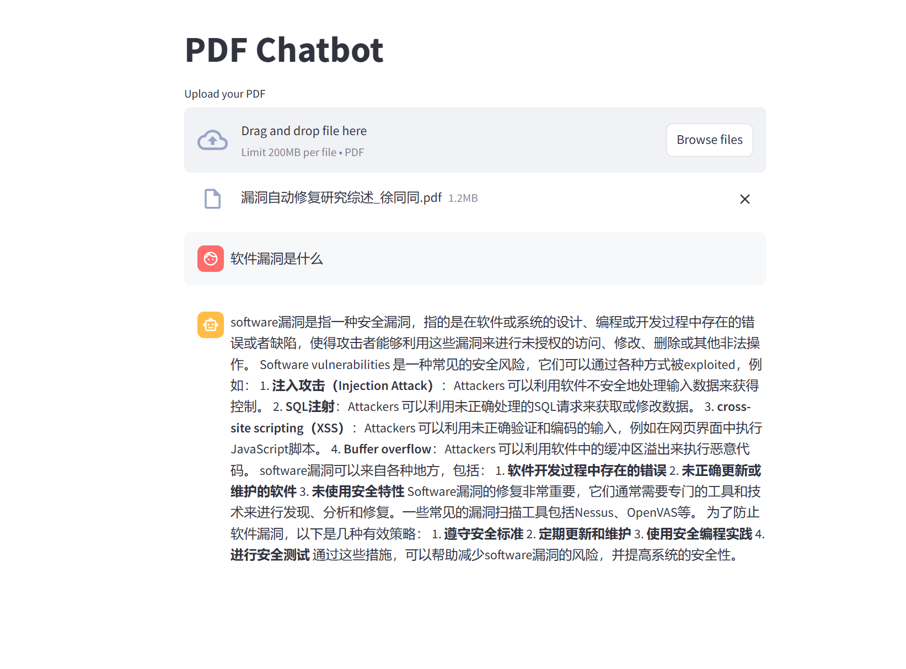

### 环境说明
- docker版本 Docker version 26.1.4
- conda版本 conda 23.1.0
- 系统信息 CentOS Linux 7 
### ollama 安装流程
``` bash
#建议docker安装，比较方便,可以避免一些奇怪的错误
#1、拉取镜像
#docker hub 地址，选则自己需要的版本
#https://hub.docker.com/r/ollama/ollama/tags
#我安装的是最新版
docker pull ollama/ollama:latest

#2、启动docker
docker run -d --gpus=all -v ollama:/root/.ollama -p 11434:11434 --name ollama ollama/ollama

#3、运行模型
#其中ollama run llama3为运行模型的命令，如果需要使用其他模型，可以参考官方提供模型版本https://github.com/ollama/ollama，将llama3替换掉即可
docker exec -it ollama ollama run llama3
```

### Langchain 安装
```bash 
#创建conda环境
conda create --name rag python=3.10
conda activate rag
#安装依赖
pip install langchain==0.3.7
pip install streamlit==1.40.1
pip install pypdf==5.1.0
pip install langchain_community==0.3.7
pip install chromadb==0.5.18
```

### 核心代码
```python
#核心代码主要包含两个模型，检索模型和生成模型，详见下文备注，模型地址为使用上面ollama启动的模型地址

from langchain.chains import RetrievalQA
from langchain.callbacks.streaming_stdout import StreamingStdOutCallbackHandler
from langchain.callbacks.manager import CallbackManager
from langchain_community.llms import Ollama
from langchain_community.embeddings.ollama import OllamaEmbeddings
from langchain_community.vectorstores import Chroma
from langchain.text_splitter import RecursiveCharacterTextSplitter
from langchain_community.document_loaders import PyPDFLoader
from langchain.prompts import PromptTemplate
from langchain.memory import ConversationBufferMemory
import streamlit as st
import os
import time

if not os.path.exists('files'):
    os.mkdir('files')

if not os.path.exists('jj'):
    os.mkdir('jj')

if 'template' not in st.session_state:
    st.session_state.template = """You are a knowledgeable chatbot, here to help with questions of the user. Your tone should be professional and informative.

    Context: {context}
    History: {history}

    User: {question}
    Chatbot:"""
if 'prompt' not in st.session_state:
    st.session_state.prompt = PromptTemplate(
        input_variables=["history", "context", "question"],
        template=st.session_state.template,
    )
if 'memory' not in st.session_state:
    st.session_state.memory = ConversationBufferMemory(
        memory_key="history",
        return_messages=True,
        input_key="question")

#这里为embedding模型   
if 'vectorstore' not in st.session_state:
    st.session_state.vectorstore = Chroma(persist_directory='jj',
                                       embedding_function=OllamaEmbeddings(base_url='http://localhost:11434', model="qwen:7b")
#这里为reader 模型                                          )
if 'llm' not in st.session_state:
    st.session_state.llm = Ollama(base_url="http://localhost:11434",
                                  model="qwen:7b",
                                  verbose=True,
                                  callback_manager=CallbackManager(
                                      [StreamingStdOutCallbackHandler()]),
                                  )

# Initialize session state
if 'chat_history' not in st.session_state:
    st.session_state.chat_history = []

st.title("PDF Chatbot")

# Upload a PDF file
uploaded_file = st.file_uploader("Upload your PDF", type='pdf')

for message in st.session_state.chat_history:
    with st.chat_message(message["role"]):
        st.markdown(message["message"])

if uploaded_file is not None:
    if not os.path.isfile("files/"+uploaded_file.name+".pdf"):
        with st.status("Analyzing your document..."):
            bytes_data = uploaded_file.read()
            f = open("files/"+uploaded_file.name+".pdf", "wb")
            f.write(bytes_data)
            f.close()
            loader = PyPDFLoader("files/"+uploaded_file.name+".pdf")
            data = loader.load()

            # Initialize text splitter
            text_splitter = RecursiveCharacterTextSplitter(
                chunk_size=1500,
                chunk_overlap=200,
                length_function=len
            )
            all_splits = text_splitter.split_documents(data)

            # Create and persist the vector store
            st.session_state.vectorstore = Chroma.from_documents(
                documents=all_splits,
                embedding=OllamaEmbeddings(model="qwen:7b")
            )
            st.session_state.vectorstore.persist()

    st.session_state.retriever = st.session_state.vectorstore.as_retriever()
    # Initialize the QA chain
    if 'qa_chain' not in st.session_state:
        st.session_state.qa_chain = RetrievalQA.from_chain_type(
            llm=st.session_state.llm,
            chain_type='stuff',
            retriever=st.session_state.retriever,
            verbose=True,
            chain_type_kwargs={
                "verbose": True,
                "prompt": st.session_state.prompt,
                "memory": st.session_state.memory,
            }
        )

    # Chat input
    if user_input := st.chat_input("You:", key="user_input"):
        user_message = {"role": "user", "message": user_input}
        st.session_state.chat_history.append(user_message)
        with st.chat_message("user"):
            st.markdown(user_input)
        with st.chat_message("assistant"):
            with st.spinner("Assistant is typing..."):
                response = st.session_state.qa_chain(user_input)
            message_placeholder = st.empty()
            full_response = ""
            for chunk in response['result'].split():
                full_response += chunk + " "
                time.sleep(0.05)
                # Add a blinking cursor to simulate typing
                message_placeholder.markdown(full_response + "▌")
            message_placeholder.markdown(full_response)

        chatbot_message = {"role": "assistant", "message": response['result']}
        st.session_state.chat_history.append(chatbot_message)


else:
    st.write("Please upload a PDF file.")

```

```bash
#执行这个命令运行即可启动服务
streamlit run app.py
#接着在浏览器访问服务地址
http://localhost:8501
#上传PDF即可进行问答对话
```

### 效果示例

