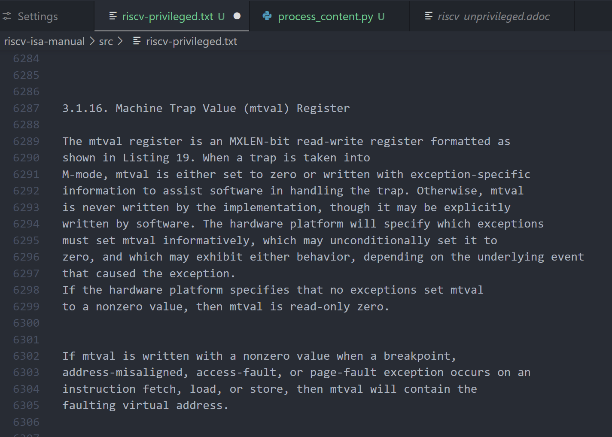
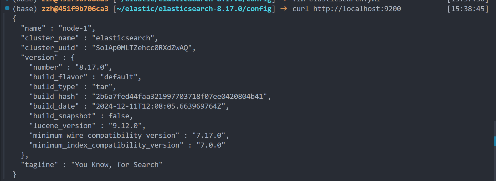

## 安装

```shell
conda activate py310  # 我是在python3.10环境下搞的
pip install beautifulsoup4
sudo apt install asciidoctor 
pip install elasticsearch
```

## 解析文本

将 https://github.com/riscv/riscv-isa-manual 仓库下的内容使用`git clone https://github.com/riscv/riscv-isa-manual.git --recursive`拉取到本地，并在目标文件夹下编写代码

```python
import subprocess
from bs4 import BeautifulSoup
import os

def convert_adoc_to_txt(input_file, output_file):
    try:
        # 使用 Asciidoctor 将 AsciiDoc 转换为 HTML:
        subprocess.run(['asciidoctor', '-o', 'temp.html', input_file], check=True)
        
        # 读取生成的 HTML 文件
        with open('temp.html', 'r', encoding='utf-8') as f:
            html_content = f.read()
        
        # 使用 BeautifulSoup 提取纯文本
        soup = BeautifulSoup(html_content, 'html.parser')
        text = soup.get_text()
        
        # 写入纯文本文件
        with open(output_file, 'w', encoding='utf-8') as f:
            f.write(text)
        
        # 删除临时 HTML 文件
        os.remove('temp.html')
        
        print(f"转换成功！纯文本文件已保存为 {output_file}")
    except subprocess.CalledProcessError as e:
        print("Asciidoctor 转换失败。")
        print(e)
    except Exception as e:
        print("转换过程中出错。")
        print(e)

def get_adoc_files(directory):
    # 列出指定目录下的所有条目
    entries = os.listdir(directory)
    # 筛选出以 .adoc 结尾的文件
    adoc_files = [file for file in entries if file.endswith('.adoc') and os.path.isfile(os.path.join(directory, file))]
    return adoc_files

if __name__ == "__main__":
    input1 = "riscv-privileged.adoc"
    input2 = "riscv-unprivileged.adoc"
    convert_adoc_to_txt(input1, input1.replace('.adoc', '.txt'))
    convert_adoc_to_txt(input2, input2.replace('.adoc', '.txt'))
```

注意如果所解析的adoc中含有类似`include::intro.adoc[]`这种语句，那么必须要其`include`的文件存在，否则会解析错误。在解析成功后查看所解析文件，如下图。



## 进行服务器中的ElasticSearch的环境搭建

### 下载并解压

为了流程走通，这里简单搭建一个es单节点启动。

首先在官网下载ES压缩包：

```python
https://www.elastic.co/elasticsearch
```

在`/home/zzh`目录下创建一个文件夹

```python
mkdir elastic
```

将下载好的ES压缩包解压到所创建文件夹中

```shell
tar -xzf elasticsearch-8.7.1-linux-x86_64.tar.gz -C /home/zzh/elastic
```

ES不能直接运行在root用户下，所以需要创建一个专用于启动ES的用户，我本来使用的就不是root，而是自己创建的用户。

### 修改配置文件

调整ES虚拟内存，虚拟内存默认最大映射数为65530，无法满足ES系统要求，需要调整为262144以上，用户切成root（后面都用root，最后启动之前在切成创建用户），打开配置文件

```shell
vim /etc/sysctl.conf
```

添加下面的配置

```shell
vm.max_map_count = 262144
```

重新加载`/etc/sysctl.conf`配置

```shell
sysctl -p
```

**出现问题：**

在使用`sysctl -p`重新加载`/etc/sysctl.conf`配置时出现了`sysctl: setting key "vm.max_map_count", ignoring: Read-only file system`的错误。

排查一段时间后，随后使用

```shell
cat /proc/cmdline 
```

发现输出为

```shell
BOOT_IMAGE=/boot/vmlinuz-5.15.0-105-generic 
root=UUID=3aaa6fa5-ba9e-4552-b91d-cc5367274e5e ro
```

​	系统启动参数显示的是ro，如果想修改配置必须改成rw，随后在任潇同学的协助下解决。

修改es进程打开的最大文件数量

```shell
vim /etc/security/limits.conf
#*               soft    core            0
#*               hard    rss             10000
#@student        hard    nproc           20
#@faculty        soft    nproc           20
#@faculty        hard    nproc           50
#ftp             hard    nproc           0
#@student        -       maxlogins       4
* soft nofile 65536
* hard nofile 65536
* soft nproc 4096
* hard nproc 4096
# End of file
```

修改es配置文件

```shell
vim /home/zzh/elastic/elasticsearch-8.17.0/config/elasticsearch.yml 
node.name: node-1
# ---------------------------------- Network -----------------------------------
# 本机ip
network.host: 0.0.0.0  # 这里我只在本机内部使用就直接使用localhost了
# 端口号
http.port: 9200
# --------------------------------- Discovery ----------------------------------
# 单机只保留一个node
cluster.initial_master_nodes: ["node-1"]
# 
xpack.security.enabled: false # 禁用x-pack安全功能，用于本地开发环境
 
xpack.security.transport.ssl.enabled: false # 禁用节点间通信加密
```

修改jvm.options内存设置 

```shell
vim /elastic/elasticsearch-8.17.0/config/jvm.options
```

默认1G，启动后会占用700M，所以机器内存至少2G以上

```shell
-Xms1g
-Xmx1g
```

启动ES

 进入ES根目录

```shell
cd /elastic/elasticsearch-8.17.0/
```

切换到zzh用户

```shell
su zzh
```

启动ES服务

```shell
./bin/elasticsearch
```

使用`curl http://localhost:9200`查看启动服务是否成功。



启动成功。