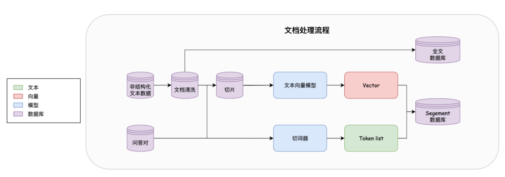

# 检索模块架构设计

## 1 架构介绍
检索模块,是RAG系统中最重要的模块之一，检索模块的目的是为了检索出高质量的文本数据作为喂入大模型的数据。检索出高质量的文本数据可以有效的提升大模型的问答能力，减少幻觉情况。
## 1.1 数据源
数据源可以分成结构化数据和非结构化数据，
- **非结构化数据**： 非结构化数据通常是网页爬取的纯文本，因此需要通过数据预处理
- **结构化数据**：结构化数据通常是json文件保存的问答对，该数据通常使用开源数据集有较高的质量可以直接存入数据库

## 1.2 数据预处理
- **文档清洗**：主要是对文档初步处理，去除一些特殊符号等。
- **切片**： 由于文档较长，无法完整保存下来，并且即使完整保存下来，当检索出较长文档输入给大模型时，大模型也无法处理过长的文档，因此需要对文档进行切片处理

## 1.3 检索模型
检索模型设计了两种检索方式，分别是ElasticSearch（ES）的关键词检索和基于Embedding的向量检索。
- **关键词检索** 关键词检索指的是通过用户查询里的关键词和文档里的关键词进行比对，来选择出较为匹配的数据。这可以通过ES数据库实现。首先将文档进行分词处理，然后通过ES数据库对文档构建倒排索引用来匹配关键词
- **向量检索** 由于关键词检索必须对字面匹配上才可以，这往往会导致相同的语义，使用不同关键词时匹配不上，例如“马铃薯”和“土豆”指的都是一个东西，但是通过关键词搜索却无法匹配，因此需要通过语义匹配检索出这类文档，这就是通过向量检索实现。通过将文本进行向量化，然后计算不同文本之间的相似度来检索文档。

    但是通过模型计算向量是一个耗时的过程，切有大量的文本数据，都转换成向量将会非常占用存储空间，因此使用Faiss向量库来存储文本向量，来提升检索速度。

